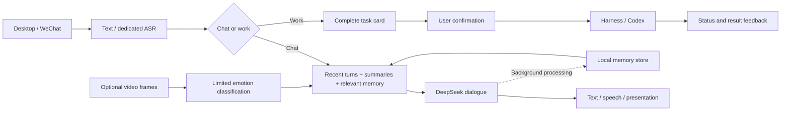

<div align="center">
  
  <h1>AAAAGENT</h1>
  <p><strong><a href="https://www.bilibili.com/video/BV1cueG6sE85/">▶ Watch the full demo on Bilibili</a></strong></p>
  <p>A desktop companion that talks, remembers, and connects your ideas to working agents.</p>
  <p><a href="README.md">简体中文</a> · <strong>English</strong></p>
  <p><a href="docs/PLATFORMS.md#english">Mac / Windows</a> · <a href="docs/SETUP.md">Setup</a> · <a href="docs/MEMORY.md#english">Memory and context</a> · <a href="docs/LIVE2D.md#english">Bring your own Live2D</a> · <a href="assets/original-design/README.md#english">Whale-girl artwork</a></p>
</div>

> [!IMPORTANT]
> **We will release our own “Big Whale DeepSeek” Live2D model in two days, on September 19, 2026.**
>
> The demo uses a **purchased third-party stock Live2D model**. Its original license prohibits redistribution, so its model files, textures, expressions and motions are not included in this project.
>
> You can also choose a free Live2D model whose license permits your intended use and adapt it locally using the [integration guide](docs/LIVE2D.md#english). Please follow each model's usage and redistribution terms.

## Watch the demo

https://github.com/user-attachments/assets/f499c069-4a13-4f79-b705-ce332d7b06f2

**Play the full demo above (about 9m 21s).** This is a 720p web playback version; [watch on Bilibili](https://www.bilibili.com/video/BV1cueG6sE85/) · [download the original-quality 1080p60 video](https://github.com/phoiex/AAAAGENT/releases/tag/demo-video-20260917).

---

> **Noncommercial only · Attribution required.** All commercial use of original project material is prohibited. Credit AAAAGENT, its authors and [the source repository](https://github.com/phoiex/AAAAGENT) when using, citing, reproducing or adapting it. See [LICENSE](LICENSE).

AAAAGENT is a desktop companion developed primarily for macOS, with a separate Windows development version, offering text and voice conversation, a WeChat entry point, and task forwarding. Describe a job, review the proposed task card, and confirm before it is sent to DeepSeek Harness or an existing Codex task. **[▶ Watch the full demo on Bilibili](https://www.bilibili.com/video/BV1cueG6sE85/)**

[Download the final demo in original quality (1080p60, corrected subtitles)](https://github.com/phoiex/AAAAGENT/releases/tag/demo-video-20260917). To meet GitHub's per-file size limit, it is split losslessly into two parts, with no re-encoding or quality reduction.

## Platforms and feedback

**macOS is currently the most complete version and the recommended starting point. The Windows version is still being improved. If you encounter a problem, please report it in this repository's Issues; we will follow up in the corresponding issue.**

| Platform | Status and entry point |
| --- | --- |
| **macOS** | The primary version, with source in the root `code/desktop-pet/`. See [Mac setup](docs/SETUP.md#english). |
| **Windows** | A separate Electron development version in `windows/code/desktop-pet/`. See [Windows setup](windows/README-WINDOWS.md). Windows Codex task forwarding is not supported; real speech, WeChat and wake-word behavior still need device-level validation. |

See [platform differences and issue reporting](docs/PLATFORMS.md#english). Include your OS version, reproduction steps and sanitized errors. Install dependencies separately for each platform; do not mix configuration or build outputs.

Companion conversation and work share an entry point without loading every project's engineering history into personal memory. Recent turns preserve continuity; long-term memories provide relevant recollections; project references locate work-specific context when needed.

**This is a source distribution.** It does not include credentials, private conversations or memory databases, WeChat login state, cloned-voice material, wake-model weights, third-party Live2D characters, or the Cubism SDK. The image above is project-produced fan artwork, **not a working Live2D model**.

New: **Memory → Import past chats** imports explicitly selected local history with pause, deduplication and forgetting protection. Review model and cost settings before starting; see the [guide](docs/MEMORY.md#import-past-chats).

## Features

The overview below primarily describes the macOS version. See the platform notes above for Windows limitations.

| Capability | What the code provides |
| --- | --- |
| Voice conversation | Push-to-talk, live level feedback, interruption by new input, and separate transcription and dialogue services. |
| Local wake detection | Opt-in keyword detection, wake-word removal, and silence-based recording completion. Compatible local weights must be supplied separately. |
| Emotion-aware responses | Limited classification of video frames; audio emotion is used only when the ASR returns a valid annotation. Missing evidence remains missing. |
| Speech and animation | TTS playback drives lip sync; thinking, work and interaction states feed character presentation. Available motions depend on the model. |
| WeChat | Text and voice input; configurable text or audio-file replies. Native voice bubbles are not a reliable supported output path. |
| Agent forwarding | Harness for appropriate smaller search/organization jobs, Codex for planning and engineering. Explicit executor choices are preserved and dispatch requires confirmation. |
| Web management | Persona prompts, stored memories, recall traces, context settings, speech configuration, presentation presets, and connection status. |

Everyday questions should stay in conversation instead of creating engineering tasks. Task requests can be supplemented, confirmed or cancelled by voice. A normal progress query selects the most recently arranged task; listing everything requires an explicit request.

## Architecture



DeepSeek handles text dialogue and structured processing. Dedicated ASR supplies the transcript, Qwen multimodal adapters process images, and the MiniMax adapter generates speech. Users supply service configurations and credentials. The application connects to existing Harness and Codex services rather than bundling another agent platform.

## How memory works

1. **Recent conversation comes first.** Within the input budget, the assembler selects a contiguous suffix of complete turns before adding summaries and relevant long-term memory.
2. **Maintenance runs in the background.** Ordinary memory-processing failures should not block subsequent chat. Forgetting and correction requests have separate privacy safeguards.
3. **Emotion keeps its provenance.** Valid emotional observations can influence responses and memory recall alongside importance and activation; a score is not a substitute for facts.
4. **Project details are retrieved on demand.** Project names, short abstracts and references stay separate from full task bodies, receipts and execution history.
5. **Users can inspect and edit.** The web interface exposes source records, edits, selected recall parameters, actual recall traces and failed processing items.

See [Memory and context](docs/MEMORY.md#english) for formulas and code references. Current retrieval uses inspectable lexical rules; it is not a general semantic vector-search implementation.

## Getting started

Mac users should read [Setup](docs/SETUP.md#english); Windows users should start with [Windows setup](windows/README-WINDOWS.md). The commands below target the root Mac source tree. This is a developer-oriented source package. A complete animated desktop setup requires your own authorized Live2D model and SDK.

```sh
cd code/desktop-pet
npm ci
npm run build
```

Compilation does not log in to WeChat, call models or open the microphone. Follow the setup document for runtime configuration, launch steps and missing-resource checks.

| Component | Bring your own |
| --- | --- |
| Text dialogue | Supported provider configuration and credentials |
| ASR / image understanding | Service access and API configuration |
| Speech output | MiniMax configuration and a voice you are authorized to use |
| Live2D | Licensed model, Cubism SDK, parameter mappings and presentation presets |
| Wake detection | Compatible keyword-spotting weights and local settings |
| Work agents | Local Harness / Codex services and the intended projects and tasks |
| WeChat | Your own account login and binding |

## Live2D and character artwork

**Different Cubism Live2D models can be integrated with local adaptation.** Parameter IDs, expression files, motion ranges and physics differ between characters. Replacing an image or copying a single model file is not sufficient. See [Live2D integration](docs/LIVE2D.md#english).

The currently available [DeepSeek whale-girl design resources](assets/original-design/README.md#english) are still static artwork and separated layers, not a finished, rigged Live2D model ready to run.

## Repository layout

```text
README.md / README.en.md   Chinese and English home pages
code/desktop-pet/          Primary macOS source
windows/                  Windows development version and validation notes
tools/                    Release checks and configuration helpers
docs/                     Setup, memory and model integration
assets/original-design/   Project-produced whale-girl fan artwork
```

## Privacy and current limits

- Conversations, memories, project references and settings are stored locally. Selected cloud services still receive the text, audio or images needed for their calls: this is not a fully offline product.
- Publish only this clean release directory. Do not add private runtime directories, databases, credentials, token-bearing links, server configurations or conversation logs.
- Wake detection is opt-in and local; it does not continuously call a cloud recognizer. ASR, dialogue and TTS after wake-up may incur charges.
- macOS is currently the most complete version. The Windows port includes source-author validation reports, which were not independently repeated on Windows during this publication. Linux desktop behavior is not validated. Phone delivery, voices and new model animations require device testing.
- Original project material is under the [Noncommercial and Attribution License](LICENSE): **all commercial use is prohibited; use or citation requires credit to the project and authors, with a source link**. Third-party dependencies, SDKs and artwork retain their separate terms; see the [artwork notice](assets/original-design/README.md#english) and third-party notices in the source tree.

When reporting an issue, provide a minimal reproduction without private data. Never attach credentials, a full conversation database or a login QR code to a public issue.

## Citation and credit

Credit the project in applications, demos, videos, articles and papers, and retain copyright notices:

> AAAAGENT — phoiex and project contributors. https://github.com/phoiex/AAAAGENT (include the version or commit and access date)

Use GitHub’s “Cite this repository” entry for citation metadata. Mark modifications and retain the license when redistributing. Credit third-party materials separately.
