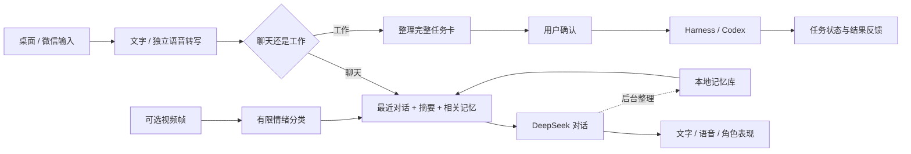

<div align="center">
  
  <h1>AAAAGENT</h1>
  <p>会聊天、记得相处，也能把想法交给工作 Agent。</p>
  <p><strong>简体中文</strong> · <a href="README.en.md">English</a></p>
  <p><a href="docs/PLATFORMS.md">Mac / Windows</a> · <a href="docs/SETUP.md">开始使用</a> · <a href="docs/MEMORY.md">记忆与上下文</a> · <a href="docs/LIVE2D.md">接入自己的 Live2D</a> · <a href="assets/original-design/README.md">DeepSeek 大肥鱼设计稿</a></p>
</div>

---

AAAAGENT 是一个以 macOS 为主要平台、同时提供 Windows 开发版的陪伴型桌面助手。你可以和它说话、用文字交流，也可以通过微信延续对话。需要完成工作时，它把需求整理成任务卡，交给你确认，再转给 DeepSeek Harness 或已有的 Codex 任务。

## 平台选择与反馈

**macOS 是目前功能最完善的版本，推荐优先体验。Windows 版持续完善中，如遇问题请及时在本仓库的 Issues 中反馈，我们会在对应 Issue 中跟进处理。**

| 平台 | 状态与入口 |
| --- | --- |
| **macOS** | 当前主要维护和使用的完整版本；源码在根目录 `code/desktop-pet/`。查看 [Mac 安装说明](docs/SETUP.md)。 |
| **Windows** | 独立 Electron 开发版；源码在 `windows/code/desktop-pet/`。查看 [Windows 安装说明](windows/README-WINDOWS.md)。目前不支持 Windows Codex 任务转交，真实语音、微信与唤醒体验仍需逐项验证。 |

详情见 [平台差异与问题反馈](docs/PLATFORMS.md)。报告问题时请附系统版本、复现步骤和去除敏感信息的报错。两个目录分别安装依赖，勿混用配置或构建产物。

陪伴和工作共享一个入口，但不把所有工程记录塞进陪伴记忆。最近的对话负责衔接，长期记忆负责回想，项目索引负责找到对应的工作上下文。

**本仓库是源码发布包。** API 凭据、个人对话和记忆、微信登录状态、音色克隆资料、唤醒模型权重、第三方 Live2D 模型与 Cubism SDK 均不随包发布。上方图片是项目制作的同人设计稿，**不是运行中的 Live2D 模型**。

## 可以做什么

以下以 macOS 版的主要能力为参考；Windows 版的可用范围见上方平台说明。

| 能力 | 使用方式 |
| --- | --- |
| 语音聊天 | 按键发言、查看实时音量反馈；新的输入可打断当前回复。转写与文字对话分别调用服务。 |
| 本地唤醒 | 开启后使用本地关键词检测；唤醒后进入正常录音，去掉唤醒词，按静音时长结束。需另行配置本地权重。 |
| 情绪相关的回应 | 视频帧做有限的情绪分类；语音情绪只在 ASR 返回有效标注时使用。有效观察可参与回应和记忆处理，不把缺失数据当成确定的情绪。 |
| 语音与角色表现 | TTS 播放与口型联动；有思考、工作、交互等表现逻辑，具体动作取决于接入模型的参数与预设。 |
| 微信聊天与任务 | 支持文字与语音输入；可配置文字回复或音频文件回复。原生微信语音条尚不作为可靠输出方式。 |
| 工作转交 | 小型检索、整理可交给 Harness；规划、架构与工程任务可交给 Codex。指定执行者时保留你的选择，发送前确认。 |
| 网页管理 | 查看和修改角色 Prompt、记忆、召回记录、上下文设置、语音配置、表现预设及连接状态。 |

日常对话不应为了“现在几点”之类的问题创建工程任务。工作流也保留语音补充、确认和取消入口；“查询任务进度”默认看最近安排的任务，明确说“所有任务”才展开全部。

## 它怎样工作



DeepSeek 负责文字对话及相关结构化处理；独立 ASR 负责忠实转写，Qwen 多模态适配器负责图像理解，MiniMax 适配器负责 TTS。模型和服务凭据由使用者配置。项目复用已有的 Harness 服务和 Codex 连接能力，不内置另一套大型 Agent 平台。

## 记忆的核心设计

1. **先接住刚才的话。** 在输入预算内优先装入连续、完整的最近几轮，再补摘要和相关长期记忆。
2. **长期整理放后台。** 保存对话后异步处理记忆；普通整理失败不应阻断后续对话。涉及遗忘、纠正的请求另有隐私保护边界。
3. **情绪是有来源的观察。** 情绪强度与重要性、活跃度共同影响长期记忆的召回；不是用一个情绪分数代替事实。
4. **工程细节按需读。** 项目索引只存名称、简短摘要和详情引用；完整任务内容、回执和执行记录不常驻陪伴上下文。
5. **用户可以管理。** 可查看来源、修改记录、调节部分召回参数、查看实际召回和处理失败的项目。

公式、数据流、失败处理和代码入口见 [记忆与上下文](docs/MEMORY.md)。当前检索以可检查的关键词规则为主，不能把它理解成已实现通用语义向量检索。

## 开始使用

Mac 用户先阅读 [安装与配置](docs/SETUP.md)；Windows 用户请直接阅读 [Windows 安装说明](windows/README-WINDOWS.md)。下面命令针对根目录的 Mac 源码。这是需要本地配置的开发者版本，完整桌宠还需要你自行准备合法授权的 Live2D 模型及 SDK。

```sh
cd code/desktop-pet
npm ci
npm run build
```

这一步编译源码，不会自动登录微信、调用模型或启动麦克风。桌面启动、服务配置和缺失资源检查的具体步骤以安装文档为准。

| 想接入的部分 | 需要自行准备 |
| --- | --- |
| 文字对话 | DeepSeek 或代码中受支持的服务配置及凭据 |
| 语音转写 / 图像理解 | 对应 ASR、多模态服务权限及 API 配置 |
| 语音输出 | MiniMax 配置及你有权使用的音色；本仓库不带私人克隆音色 |
| Live2D | 授权模型、Cubism SDK、参数映射和自己的表现预设 |
| 本地唤醒 | 适配的关键词检测模型与本地配置 |
| 工作 Agent | 本机 Harness / Codex 服务，以及需要转交的项目和任务 |
| 微信 | 使用者自己的账号登录与绑定 |

## Live2D 与角色设计

**支持接入不同的 Cubism Live2D 模型，但需要本地适配。** 不同模型的参数 ID、表情文件、动作范围和物理设置不同，不能只替换一张图片或复制一个文件就获得全部动作。查看 [Live2D 接入说明](docs/LIVE2D.md)。

现用的第三方模型、纹理、表情、动作、模型截图及录屏均不发布。项目的 [DeepSeek 大肥鱼设计稿与基础资源](assets/original-design/README.md) 单独列出来源和制作状态；它们目前是静态美术与拆层资源，尚未完成 Cubism 绑定和连续动画验收。

## 目录

```text
README.md / README.en.md   中英文项目首页
code/desktop-pet/          macOS 主版本源码
windows/                  Windows 独立开发版、启动入口与验证说明
tools/                    发布检查与配置辅助工具
docs/                     安装、记忆、模型接入说明
assets/original-design/   项目制作的鲸鱼娘同人设计与基础素材
```

## 隐私、发布与当前边界

- 本地保存对话、记忆、项目索引和配置；调用云服务时，会把所需的文本、音频或图像发送给所选供应商，因此不是完全离线产品。
- 只应提交这个干净发布目录。不要复制私人运行目录、数据库、登录凭据、带令牌的链接、服务器配置或含聊天内容的日志。
- 唤醒默认不开启；本地检测不产生持续的云端识别请求。唤醒后的 ASR、对话、TTS 仍可能计费。
- macOS 是目前最完善的版本；Windows 发布包附有移植作者的验证记录，本次发布未重新进行 Windows 真机验收。Linux 桌面版未验证。手机实际显示、音色效果及新模型动作需在自己的设备验证。
- 软件代码尚未指定统一开源许可证；公开源码不等于已经授予 MIT 等使用许可。第三方依赖、SDK 和角色素材分别遵循各自条款，见 [角色资源说明](assets/original-design/README.md) 及源码中的第三方声明。

欢迎用不含私人数据的最小复现描述问题。不要在公开 Issue 中粘贴真实凭据、完整对话库或登录二维码。
