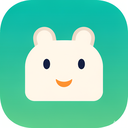

<p align="center">
  
</p>

# PetShell

PetShell is the local desktop-pet sidecar for the **Aiki** companion runtime. It shows a
transparent always-on-top pet window, keeps local pet packages on disk, and exposes a
loopback control API that the host uses for status, actions, bubbles and companion events.

PetShell is a fork of [OpenPet](https://github.com/X-T-E-R/OpenPet). Upstream copyright,
the `LICENSE` file and the attribution in Settings → About are kept; see
[Licensing and attribution](#licensing-and-attribution).

## Scope

In scope for this fork:

- The desktop pet window: sprites, bubbles, click reactions, idle behaviour, tray menu.
- Local pet packages (`pet.json` + `spritesheet.webp`).
- A loopback HTTP API for a single host, plus single-instance and protocol-exit lifecycle.
- A renderer/behaviour/menu plugin surface so another renderer (for example Live2D) can be
  swapped in without touching the API.

Deliberately out of scope, and removed from upstream: remote/site pet import, the
self-updater, and the bundled agent skill installer.

## Quick Start

```powershell
pnpm install
pnpm tauri:dev
```

To build:

```powershell
pnpm build            # tsc --noEmit && vite build
pnpm tauri:build      # bundles for the current platform
```

Development and manual verification happen on Windows.

## HTTP API

The API listens on `127.0.0.1:17321` by default; the address and port are configurable in
Settings and take effect after a restart.

```http
GET  /api/status
POST /api/action        {"animationId": "waving"}
POST /api/say           {"text": "...", "ttlMs": 4000}
POST /api/event         {"type": "thinking", "message": "...", "ttlMs": 4000}
POST /api/import/local  {"source": "./public/pets/nia"}
POST /api/shutdown      Authorization: Bearer <exit token>
GET  /api/pets/<id>/spritesheet
```

`/api/event` accepts `thinking`, `tool-running`, `reviewing`, `success`, `failure` and
`attention`. Successful control responses return the full runtime snapshot; errors are
`{"error": "...", "ok": false}` with `400` for a bad request body, `404` for an unknown
route, `401`/`403` for a rejected exit credential and `503` while a shutdown is in flight.

### Identity and lifecycle

`/api/status` reports the real product rather than the upstream project:

```json
"product": { "name": "PetShell", "version": "0.6.0", "upstream": "OpenPet v0.1.6 (GPL-3.0-or-later)" }
```

and the lifecycle capabilities of the running process:

```json
"capabilities": {
  "singleInstance": true,
  "instanceOwner": true,
  "shutdown": { "endpoint": "/api/shutdown", "version": 1, "auth": "bearer-token", "available": true, "reason": null }
}
```

**Single instance**: one instance per Windows user session. A second launch exits without
creating a window or a second HTTP service, and surfaces the instance already running.
Ownership is never inferred from the port.

**Protocol exit**: `POST /api/shutdown` exits the process, releasing the HTTP listener and
the tray. It is only available to the process that spawned PetShell: set the
`PET_SHELL_EXIT_TOKEN` environment variable (at least 16 characters) before launch and send
it as `Authorization: Bearer <token>`. Without that variable the endpoint answers `403` for
everyone, including callers from `127.0.0.1` — a loopback address is not authentication. A
client attached to the API cannot exit the process. The token is never logged.

## Settings

Open Settings from the tray or the pet's right-click menu. Settings cover language, pet
selection, click behaviour, bubble appearance, movement, idle behaviour, local pet storage,
and the API endpoint. The **API / Host** tab also shows the runtime status (product,
instance role, protocol-exit state, attribution).

## Licensing and attribution

- PetShell is licensed under **GPL-3.0-or-later**; see `LICENSE`. It is a modified fork of
  OpenPet v0.1.6, and the upstream copyright notice, `LICENSE` and source attribution are
  retained.
- Live2D Cubism Core, if a Live2D renderer is enabled, is proprietary software of Live2D
  Inc. distributed under the Live2D Proprietary Software License Agreement. It is not
  covered by the GPL and is not free software.
- Bundled sample art may carry separate rights. Only bundle assets you have the right to
  distribute.

PetShell is not affiliated with, endorsed by, or sponsored by OpenPet, OpenAI, or any
community gallery.
