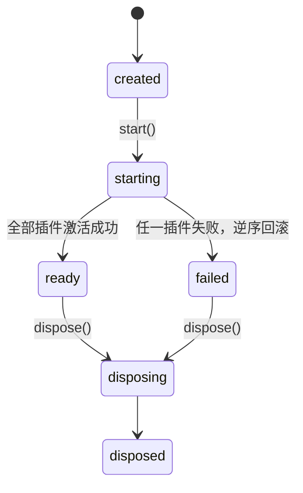

# CORE 内核架构与接口

下列代码块是**拟定逻辑契约**：名称可调，语义与 AC 不可省略。现有实现通过 adapter 映射，不要求一次性重命名源码。方案背景见 [重构计划书](REFACTOR_PLAN.md)。

## 零、内核不变量

**内核不知道这个产品有哪些业务能力。**

它不认识 runtime、memory、voice、storage、remote、sticker，也不认识「宿主」有哪些本事。它只认识四样东西：token（不透明标识）、factory、plugin（声明了要什么、给什么）、生命周期。

据此，内核**不定义任何 token 实例**，不导出 `CoreTokens` 之类的中央清单，也不定义 `HostCapabilities` 之类的能力总表——那种类型一旦存在，「新增一种能力」就等于「改内核」，本次重构就白做了。

这条不变量优先于下面任何一条设计；两者冲突时改设计，不改不变量。它由 CORE-01-C / CORE-01-F 的静态扫描守住，不靠自觉。

## 一、分层与依赖方向

```
components                        ← 只能向下依赖
presentation (Presenter)
app/ (composition root + hosts + plugins)
services (runtime / storage / memory / voice / provider)
domain (纯函数)                   ← 谁都不依赖
kernel                            ← 与上面所有层正交，不依赖任何一层
```

组合根与宿主插件放 `src/app/`，**不放 `src/kernel/`**：它们必须 import 具体实现，
而内核一行业务代码都不能碰。这条在 CORE-02 执行时才暴露出来——早先把它们写进
`src/kernel/hosts/` 会直接撞上 CORE-01-C 的扫描。

- `src/kernel/` 不 import `src/domain/`、`src/services/`、`src/presentation/`、`react`、`@tauri-apps/*`，也不触碰 `window`/`document`/`localStorage`/`__TAURI_INTERNALS__`。它是一个可以整包搬去别的项目、不带一句本产品语义的模块。
- `domain/` 同样不 import react 与平台 API。
- `services/` 不 import `presentation/` 或 `components/`。
- 平台差异只允许出现在 `src/app/hosts/detect.ts` 里，由 CORE-02-C 的扫描守住。

## 二、服务标识与注册表

字符串裸键会在重命名时静默失效，因此用带类型的 token。token 对内核是不透明的：它只比较标识，不理解含义。

```ts
declare const serviceBrand: unique symbol;
export interface ServiceToken<T> {
  readonly key: string;
  /** 仅用于类型推导，运行期不存在。 */
  readonly [serviceBrand]?: T;
}
/** 内核只提供这个工厂，自己一个 token 实例都不创建。 */
export function token<T>(key: string): ServiceToken<T>;

export interface ResolveContext {
  resolve<T>(token: ServiceToken<T>): T;
}

export interface ServiceRegistry {
  has(token: ServiceToken<unknown>): boolean;
  /** 未注册即抛 SERVICE_NOT_REGISTERED，禁止返回 undefined 让调用方自己猜。 */
  resolve<T>(token: ServiceToken<T>): T;
  tryResolve<T>(token: ServiceToken<T>): T | null;
}
```

- **注册能力不在 `ServiceRegistry` 上。** 对外只读；写入只能通过插件拿到的 `PluginRegistrar`（见第四节）。这样「谁提供了这个服务」永远有唯一答案。
- 单例作用域。工厂惰性且**至多执行一次**，结果缓存；并发 resolve 拿到同一个实例。
- 重复注册同一 token 抛 `SERVICE_ALREADY_REGISTERED`，不做静默覆盖——覆盖会让来源不可追溯。
- 解析成环抛 `SERVICE_CYCLE`，错误里带完整解析链，不允许栈溢出。
- 内核未 `ready` 时从外部 resolve 抛 `KERNEL_NOT_READY`；`failed` 状态下抛 `KERNEL_FAILED`。半装配的服务不许流出去。

## 三、内核与生命周期

```ts
export type KernelState =
  | "created" | "starting" | "ready" | "failed" | "disposing" | "disposed";

export interface AikaKernel {
  readonly registry: ServiceRegistry;   // 只读视图
  readonly events: KernelEventSource;   // 只能订阅
  readonly state: KernelState;
  /** 只能在 created 阶段调用。 */
  use(plugin: AikaPlugin): this;
  start(): Promise<KernelStartReport>;
  dispose(): Promise<void>;
  describe(): KernelSnapshot;
}

export interface KernelStartReport {
  ok: boolean;
  state: "ready" | "failed";
  activated: readonly string[];
  /** 激活失败的插件；ok 为 false 时至少一条。 */
  failed: readonly { pluginId: string; code: string; message: string }[];
  /** 回滚期间 deactivate 自己抛的错，单独列，不与上面混淆。 */
  rollbackErrors: readonly { pluginId: string; message: string }[];
  durationMs: number;
}

export interface KernelSnapshot {
  state: KernelState;
  plugins: readonly {
    id: string; version: string;
    status: "pending" | "activated" | "failed" | "rolledBack" | "skipped";
    error?: { code: string; message: string };
  }[];
  services: readonly { key: string; providedBy: string; instantiated: boolean }[];
}
```

### 状态迁移



- 排序：按 `requires` 与 `optional` 建图后拓扑排序。缺少 `requires` 的供给方、或图中成环时，**在激活任何插件之前**返回 `ok: false`、state 置 `failed`，不留半启动状态。`optional` 缺供给方不算错误，只是少一条边。
- `optional` 也参与排序并同样受成环检查约束。不做「遇环就忽略软边」这种隐式规则——那会让激活顺序随依赖变化而不可预测。
- 激活失败：按已激活的**逆序** `deactivate`，state 置 `failed`。回滚过程中的异常收集进 `rollbackErrors`，既不吞掉也不中断剩余回滚。
- `failed` 是终态之一：再次 `use()` 或 `start()` 抛 `KERNEL_FAILED`。**不支持原地重试启动**——重试要新建内核实例，否则会带着上一次的半状态跑。
- `failed` 下 `dispose()` 必须可用且幂等，把回滚残留的 `onDispose` 清干净。
- `describe()` 在**任何状态下都可用**，`failed` 时必须指出是哪个插件、什么错误码。诊断在失败时最需要，不能这时候用不了。
- `dispose()` 逆序释放，幂等；只释放已实例化的服务，未被 resolve 过的工厂不得为了释放而被实例化。

## 四、插件契约与作用域注册器

插件对内核而言只是一份声明加两个回调。内核不检查它提供的是什么，只检查**它说的和它做的是否一致**。

```ts
export interface AikaPlugin {
  readonly id: string;
  readonly version: string;
  /** 硬依赖：缺一个就排不出序，启动失败。 */
  readonly requires?: readonly ServiceToken<unknown>[];
  /** 软依赖：允许缺失，缺失时只能经 tryResolve 拿到 null。 */
  readonly optional?: readonly ServiceToken<unknown>[];
  readonly provides?: readonly ServiceToken<unknown>[];
  activate(ctx: PluginContext): void | Promise<void>;
  deactivate?(): void | Promise<void>;
}

export interface PluginContext {
  /** 作用域注册器：只在本次 activate 内有效，只能碰本插件声明过的 token。 */
  readonly registrar: PluginRegistrar;
  readonly events: KernelEventSource;
  readonly logger: KernelLogger;
  onDispose(cleanup: () => void | Promise<void>): void;
}

export interface PluginRegistrar {
  /** token 不在 provides 里，抛 TOKEN_NOT_DECLARED。 */
  provide<T>(
    token: ServiceToken<T>,
    factory: (ctx: ResolveContext) => T,
    options?: { disposer?: (value: T) => void | Promise<void> },
  ): void;
  /** token 不在 requires 里，抛 DEPENDENCY_NOT_DECLARED。 */
  resolve<T>(token: ServiceToken<T>): T;
  /** token 不在 optional 里，抛 DEPENDENCY_NOT_DECLARED；缺供给方时返回 null。 */
  tryResolve<T>(token: ServiceToken<T>): T | null;
}
```

- **没有 `ctx.host`，也没有全量 `ctx.registry`。** 插件拿不到「所有服务」这种东西，只能拿到自己声明过的那几个。声明即依赖图，依赖图即事实——不是注释里的君子协定。
- `activate` 返回后 registrar 立即失效：仍持有引用再调用任何方法抛 `REGISTRAR_REVOKED`。这是能力回收，不是在共享注册表上翻一个布尔位。
- 声明与事实必须一致：`provides` 里的 token 未全部 `provide`，该插件激活失败；`provide` 未声明的 token，抛 `TOKEN_NOT_DECLARED`。少给和多给都是错误，不是警告。
- 插件之间不得直接 import 对方模块，只通过 token 通信。
- `activate` 里的 I/O 要可取消；耗时初始化放进服务工厂惰性执行，不拖慢启动。

## 五、内核事件

```ts
export type KernelEvent =
  | { type: "plugin.activated"; pluginId: string; durationMs: number }
  | { type: "plugin.failed"; pluginId: string; code: string; message: string }
  | { type: "plugin.rolledBack"; pluginId: string }
  | { type: "service.registered"; key: string; pluginId: string }
  | { type: "kernel.ready"; durationMs: number }
  | { type: "kernel.failed"; code: string }
  | { type: "kernel.disposed" };

/** 对插件与外部只暴露订阅：事件流是内核的诊断输出，不是公共消息总线。 */
export interface KernelEventSource {
  subscribe(listener: (event: KernelEvent) => void): () => void;
}
```

- 事件类型是**封闭联合**，且全部是内核自身的生命周期事实，不含一个业务词。插件不能 publish，因此这条总线永远长不成「什么都往里塞」的应用事件总线。
- 订阅者异常隔离，一个坏订阅者不得阻断其他订阅者或内核启动。
- 业务侧的 turn 增量、终态、取消**只**走 `CompanionRuntime` 的 `RuntimeEvent`。两套事件混用会让顺序与幂等保证失效。

## 六、token 的所有权

**没有中央 token 清单。** 每个 token 定义在它所描述的接口旁边，由那个模块自己导出：

| token | 定义位置 | 类型来源 |
| --- | --- | --- |
| `RuntimeToken` / `ProviderToken` | `services/runtime/tokens.ts` | 现有 `CompanionRuntime` / `RuntimeProvider` |
| `ContextSourcesToken` | `services/context/tokens.ts` | 现有 `ContextSource` |
| `StorageToken` / `SecretStoreToken` | `services/storage/tokens.ts` | 现有 `AikaStorage` / `SecretStore` |
| `MemoryRepositoryToken` | `services/memory/tokens.ts` | 现有 `MemoryRepository` |
| `SpeechInputToken` / `SpeechOutputToken` | `services/voice/tokens.ts` | 现有 `SpeechInputEngine` / `SpeechOutputEngine` |
| `NotifierToken` / `ClockToken` / `TimerToken` | 与各自实现同目录 | 现有 `RuntimeClock` / `TimerPort` |
| `RemoteHostToken` | `services/remote/tokens.ts` | 现有 bridge 接口 |
| `CompanionPresenterToken` | `presentation/tokens.ts` | 前端架构已定义的契约 |

规则：

- 任何文件不得导出跨越两个以上模块目录的 token——桶文件是中央清单的另一种写法。
- 消费方 import 具体 token，不 import 汇总模块；这样「谁用了什么」在 import 图上直接可见。
- 上表里的接口**全部已经存在**，本模块只负责给它们配 token 并装配，不重新发明。

## 七、平台差异

不存在 `HostCapabilities` 这样的能力总表。平台端口就是普通服务，由**宿主插件**注册：

- `browserHostPlugins()`：localStorage 存储、内存密钥、no-op 通知、系统时钟。
- `tauriHostPlugins()`：SQLite 存储、DPAPI 密钥、系统通知、Remote 端口。
- `testHostPlugins()`：内存实现与假时钟。

```ts
/** 全仓唯一允许判断「我在哪个平台」的函数；它返回插件，不返回能力。 */
function selectHostPlugins(): readonly AikaPlugin[];
```

- 平台没有某项能力，等于那个 token **不注册**。消费方在 `optional` 里声明它并 `tryResolve`，拿到 null 就降级、隐藏入口，不弹错误、不阻断启动。缺失是常态，不是异常。
- 内核对以上一无所知：它看到的只是「若干插件，各自声明了要什么给什么」。

## 八、展示层

`CompanionPresenter` 沿用 [前端架构](../frontend/ARCHITECTURE.md) 已定义的契约，本模块不另开一套。补充约束：

- Presenter 用 `getSnapshot()` + `subscribe()` 对接 React 的 `useSyncExternalStore`；快照必须是不可变引用，未变化时返回同一个对象，避免无谓重渲染。
- Presenter 不 import React，可在无 DOM 的 node 环境构造并驱动。
- Hook 只允许做三件事：`useService(token)` 取依赖、订阅快照、把用户操作转成 Presenter 命令。不得在 Hook 里拼提示词、发请求、算检索或写库。
