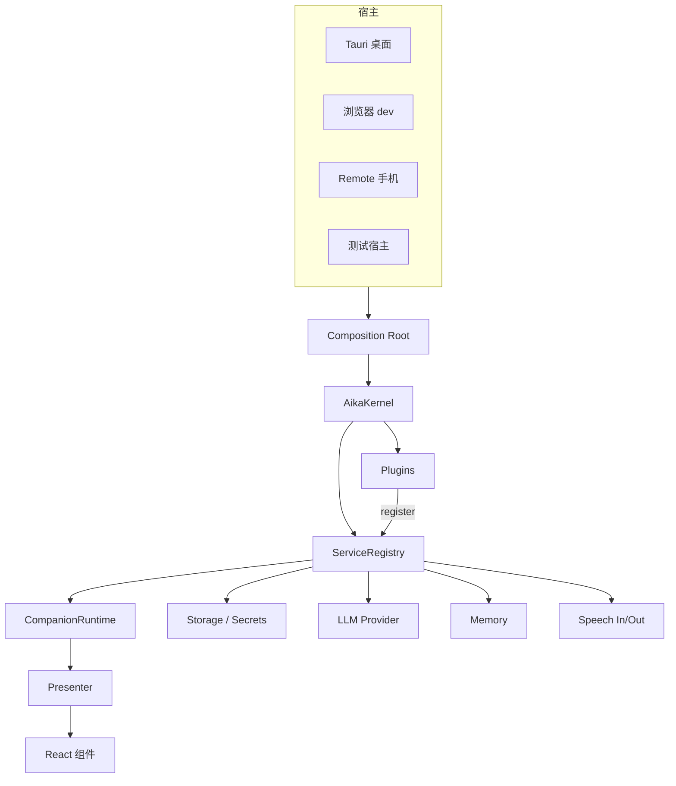

# CORE 重构计划书 · Runtime Kernel / Plugin & DI

写于 2026-09-10，基础 commit `09afec2`。本文件是方案与拆分依据，**不含任何源码改动**；每一步的执行要求写在 [specs/](specs/)。

用户提出的 “CORE-01 Runtime Kernel / Plugin & DI Architecture” 在这里对应**整个 CORE 模块**，拆成 CORE-01…06 六份可独立下发、独立验收的 SPEC。名字沿用模块内编号，不与 LLM/STT/TTS/FE 的编号混用。

## 一、现状查证

以下每条都在 `09afec2` 的代码里核对过，不是推断。

| # | 事实 | 证据 |
| --- | --- | --- |
| 1 | **应用里存在两条互不相干的对话编排路径**，而新的那条没有被任何生产代码使用 | `createCompanionRuntime` 的全部 import 方来自 `companionRuntime.test.ts` / `providerAdapter.ts`；`App.tsx:23` 走的是 `useCompanionSession()` |
| 1b | 同批建成的 `createMemorySource` / `createMemoryWriteback` 也只有测试在用 | `services/memory/memorySource.ts` 仅被 `crossSession*.test.ts` import；`services/memory/writeback.ts` 无任何生产调用方 |
| 2 | 真正在跑的编排是一个 React `useCallback` | `hooks/useCompanionSession.ts:351` 的 `send()` 约 330 行，自己处理 pending 消息、流式增量、打断、播放回执、落库 |
| 3 | 该 Hook 直接调用 Provider 协议层 | `useCompanionSession.ts:29` import `sendChat/streamChat`；`:442`、`:557` 直接发请求 |
| 4 | 该 Hook 没有任何注入口 | `App.tsx:23` `useCompanionSession()` 无参数；依赖全在 `:187` 起的 `useEffect(..., [])` 里自建（`openStorage`、`createMemoryRepository`、`createModelMemoryExtractor`、`loadStickers`、`secretStore`） |
| 5 | 平台实现靠全局嗅探选择，而不是宿主装配 | `services/storage/index.ts` 的 `inTauri()` 判断 `"__TAURI_INTERNALS__" in globalThis`；`useCompanionSession.ts:112` 的 `notify()` 里又嗅探一次 |
| 6 | 密钥库是模块级单例导出 | `services/storage/secretStore.ts` 导出 `secretStore` 值，替换只能靠 mock 模块 |
| 7 | 语音 Hook 同样自建实现 | `useVoiceConversation.ts:118` `createSpeechQueue(webSpeechOutput)`、`:514` `createInputEngine(...)` |
| 8 | 为了测 Hook 里的业务逻辑，仓库自造了一个 React 运行时 | `hooks/hookHarness.ts`（手写 slot 版 useState/useEffect/useMemo） |
| 9 | 第二个宿主已经存在 | `useRemoteAccess` + `services/remote/bridge.ts` 用 Tauri `invoke` 把手机端的一轮交回桌面执行 |
| 10 | 端口形态的接口已经有了，缺的是统一装配 | `RuntimeProvider`、`RuntimeStorage`、`ContextSource`、`MemoryV2Store`、`SpeechInputEngine`、`SpeechOutputEngine` 都已是可注入接口 |
| 11 | `domain/` 基本是纯函数，没有平台依赖 | 25 个 domain 文件，改造压力集中在 `services/` 与 `hooks/` |

结论：**这次重构真正的收益不是“引入 DI”，而是消灭第 1 条的双编排，并让第二条路径以后长不出来。** DI 是达成手段，不是目的。如果只加一个容器而不把 `send()` 换成 Runtime，收益接近零。

## 二、为什么现在做，而不是继续往 Hook 上堆功能

抓屏、情感识别、Live2D、Three.js、Unity 这些能力有一个共同点：**它们都要在一轮对话的生命周期里插入自己的输入或输出**。在当前结构下，每加一个就要再改一次 `useCompanionSession.send()`——那个函数已经 330 行，且它的正确性（打断、迟到结果、落库、播放回执）没有独立于 React 的测试保护，只能靠 `hookHarness` 模拟 React 来测。

再叠五个能力，`send()` 会变成不可审阅的函数，而且每个新宿主（手机、Unity、独立进程）都要把它重抄一遍。

反过来，先做 CORE：新增能力 = 新增一个插件文件 + 一行注册，内核和已验收的 turn 生命周期不动。

## 三、目标架构

详细接口写在 [ARCHITECTURE.md](ARCHITECTURE.md)，这里只给形状。

六条硬边界，违反即视为本次重构失败：

1. **内核连「有哪些业务能力」都不知道。** 这是第一条，其余五条服务于它。`AikaKernel` 只认识 token、factory、plugin、生命周期，不认识 runtime / memory / voice / storage / remote 是什么，也**不定义任何 token 实例**。判据：`src/kernel/` 能整包搬去别的项目而不带一句本产品语义。
2. **没有中央清单，也没有能力总表。** 不存在 `CoreTokens` 这样的 token 桶，也不存在 `HostCapabilities` 这样把平台本事列全的接口。token 定义在它所描述的接口旁边，由那个模块自己导出；平台端口就是普通服务，由宿主插件注册。有总表，「加一种能力」就等于「改内核」。
3. **插件只能碰自己声明过的东西。** `activate` 收到的是一个作用域 registrar，不是全量注册表，更没有 `ctx.host`。注册未声明的 token、解析未声明的依赖都是错误；`activate` 返回后该 registrar 立即失效。声明即依赖图，依赖图即事实。
4. **依赖方向单向。** `domain/` ← `services/` ← 组合根与插件 ← `presenter` ← `components`；`kernel/` 与这些层正交，不依赖其中任何一层。`domain/` 与 `kernel/` 都不得 import React、`@tauri-apps/*` 或 DOM 专有 API。
5. **`resolve()` 只出现在三个地方**：组合根、`plugin.activate()`、React 的 `useService()`。业务类通过构造参数拿依赖。否则 DI 会退化成一个换了皮的全局单例。
6. **内核事件不承担 turn 语义。** `KernelEvent` 是只含内核自身生命周期事实的封闭联合，插件只能订阅、不能 publish。turn 的顺序、取消、终态仍然只由 `CompanionRuntime` 的 `RuntimeEvent` 保证。

需要说明的是，第 2、3 条相对于「加一层容器」是**减法**：`HostCapabilities` 与 `CoreTokens` 这两个聚合类型被删掉，插件拿到的面也变窄了。目标不是多几层抽象，而是让内核少知道一点。

## 四、迁移策略

原则：**每一份 SPEC 交付后应用都能正常跑起来**，不接受“中间有三天是坏的”。

| 阶段 | 手法 | 应用状态 |
| --- | --- | --- |
| CORE-01 | 纯新增 `src/kernel/`，无人使用，且不含一个业务词 | 完全不受影响 |
| CORE-02 | 新增宿主插件与分散 token；旧 `openStorage()`/`secretStore` 保留为 deprecated 转发 | 行为不变 |
| CORE-03 | 编排双实现 + 运行期开关，默认仍走旧路径，验收通过后翻转默认值 | 可一键回滚，不用 revert 代码 |
| CORE-04 | Presenter 取代 Hook 内逻辑，Hook 变订阅器 | UI 行为不变 |
| CORE-05 | 已有能力搬进插件，接口不变 | 行为不变 |
| CORE-06 | 删除旧路径与开关，冻结契约 | 单一路径 |

### 两个必须明确处理的兼容点

- **turnId 类型冲突。** 已持久化的 `ChatMessage.turnId` 是 `number`（语音回合号，`domain/voiceRuntime.ts:54`），而 `CompanionRuntime` 的 turnId 是 `string`。**不改已落库字段的语义**：新增 `runtimeTurnId?: string`，`turnId` 保持 number 且可缺省，读旧库不得报错、不得把 undefined 当 0。
- **旧摘要与旧记忆迁移。** `useCompanionSession.ts:220` 起的 `migrateLegacy` 是幂等的，搬进插件后必须仍然只跑一次，不能因为换了装配方式重跑一遍。

### 回归基线（贯穿 CORE-03 起的每一份）

现有 `useCompanionSession.integration.test.ts`、`useCompanionSession.memoryV2.test.ts`、`companionRuntime.test.ts`、`contextAssembler.test.ts`、`writeback.test.ts`、`memoryRepository.test.ts` 是本次重构的**行为契约**。CORE-03 要求同一份 Hook 集成测试在新旧两条编排下都通过；任何一条测试为了迁移而被删改，必须在验收报告里单列原因和替代证据，不得静默重写断言。

## 五、SPEC 拆分与门禁

| SPEC | 交付 | 前置 | 主要风险 | 预计触及文件 |
| --- | --- | --- | --- | --- |
| [CORE-01](specs/CORE-01_KERNEL_REGISTRY.md) | Kernel / 只读注册表 / 作用域注册器 / 含 failed 的生命周期 / 诊断 | 无 | 低（纯新增） | 新增 `src/kernel/*` |
| [CORE-02](specs/CORE-02_HOST_COMPOSITION.md) | 宿主插件与组合根，去掉 `inTauri()` 嗅探 | CORE-01 | 中（存储/密钥装配） | `services/storage/*`、各模块 `tokens.ts`、新增 `src/kernel/hosts/*` |
| [CORE-03](specs/CORE-03_RUNTIME_SERVICE.md) | Runtime 服务化，编排单一化，带开关 | CORE-02 | **高**（turn 生命周期） | `hooks/useCompanionSession.ts`、`services/runtime/*` |
| [CORE-04](specs/CORE-04_PRESENTER_ADAPTER.md) | Presenter 层，Hook 降级为 Adapter | CORE-03 | 中（UI 状态） | `hooks/*`、新增 `src/presentation/*`、`App.tsx` |
| [CORE-05](specs/CORE-05_PLUGIN_CAPABILITY.md) | 插件契约，既有能力插件化，扩展点验证 | CORE-04 | 中（装配搬迁） | `services/voice/*`、`services/memory/*`、`services/remote/*` |
| [CORE-06](specs/CORE-06_DECOMMISSION.md) | 旧路径下线、开关移除、共享契约更新 | CORE-05 | 低 | 删除为主 + `docs/modules/CONTRACTS.md` |

一次只下发一份，按 [AGENTS.md](../../AGENTS.md) 的规则执行；每份交付 `reports/CORE-0N_ACCEPTANCE.md`。CORE-03 与 CORE-04 涉及共享契约变更，按 [集成 SPEC](../integration/SPEC.md) 在 INT-01 安排消费者兼容测试，但不在小阶段跑全仓测试或打包。

## 六、本模块明确不做的事

- **不实现抓屏、情感识别、Live2D、Three.js、Unity。** CORE 只保证它们进来时是新增插件，而不是再改一次内核。
- **不做跨进程 / 跨机器的服务总线。** 当前多宿主指的是同一进程内多入口（桌面 UI、Remote 手机、测试宿主）。真正的进程外宿主要另立 SPEC。
- **不做装饰器 / reflect-metadata 版 DI。** 保持工厂函数 + 类型化 token，不开 `experimentalDecorators`，不引新依赖。
- **不做热插拔与插件沙箱。** 插件是编译期就在包里的一等模块，不是运行期下载的第三方代码。
- **不做中央 token 清单与能力总表。** 没有 `CoreTokens`，没有 `HostCapabilities`，没有汇总 token 的桶文件。这条是边界 2 的执行形态，不是风格偏好。
- **不做多实例作用域（scoped/transient）。** 只有单例。会话级实例等真有第二个并发会话时再立 SPEC，不提前抽象。
- **不顺手重写 `domain/`。** 它已经是纯的，本次不动。
- **不改 STT/TTS/LLM 的既有算法与协议。** 只改它们被谁装配、被谁调用。

## 七、风险与对策

| 风险 | 后果 | 对策 |
| --- | --- | --- |
| CORE-03 改动 turn 生命周期，回归 LLM-02/03 已验收行为 | 打断、迟到结果、落库出现静默退化 | 同一份集成测试跑新旧两条路径；开关可回滚；`interrupted`/`playbackStatus` 单列 AC |
| DI 退化为服务定位器 | 依赖再次隐式化，等于白做 | CORE-01-D：静态扫描 `resolve(` 出现位置，越界即 FAIL |
| 内核长成上帝对象 | 下一次重构成本更高 | CORE-01-C：内核不得 import 业务模块，且除工厂定义外不得出现任何 token 实例，静态扫描 |
| 总表复辟：有人图省事又建一个 `CoreTokens`/`AppServices` 桶 | 「加能力=改内核」悄悄回来 | CORE-02-D：扫描不存在能力总表，且无文件导出跨两个以上模块目录的 token |
| 插件互相偷用未声明的依赖 | 依赖图失真，拓扑排序失去意义 | CORE-01-B：作用域 registrar 对未声明的 token 直接抛错，activate 后回收 |
| 启动失败留下半装配状态 | 服务半可用、错误难定位 | CORE-01-E/F：`failed` 状态、逆序回滚、`rollbackErrors`、失败时 `describe()` 仍可用 |
| Hook 只是“看起来瘦了”，逻辑挪进 Presenter 后仍绑 React | 多宿主目标落空 | CORE-04-C：Presenter 测试在无 React 的环境跑通 |
| 迁移半途停摆，两条路径长期共存 | 最坏的中间态 | CORE-06 是独立门禁，未执行则本模块不算完成 |
| 旧持久化数据读不出来 | 用户记忆丢失 | turnId 新增字段而非改写；迁移幂等性单列 AC |

## 八、完成的定义

CORE 模块通过 = 六份 SPEC 各自 PASS，且同时满足：

1. 全仓只有一条对话编排路径，`providerClient` 的调用方只剩 Runtime 侧适配与 memory extractor。
2. `hooks/useCompanionSession.ts` 不再 import 任何 `services/` 实现（token 与类型除外）。
3. 新增一个空能力插件，diff 只含新文件加一行注册，`App.tsx` 与 `src/kernel/` 零改动。
4. 内核与 Presenter 的测试不依赖 `hookHarness`。
5. `src/kernel/` 里搜不到 runtime / memory / voice / storage / remote / sticker 任何一个业务词，也没有一个 token 实例。
6. 全仓不存在能力总表，也不存在跨模块的 token 汇总文件。

模块通过不等于全流程通过；真实模型质量、真人语音与设备验收仍按既有 DEFERRED 安排，不因本次重构改标签。
