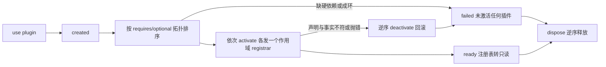

# CORE-01 · 内核与服务注册表

状态：**已自测（待审阅）**。4 文件 / 52 测试通过，静态门禁经突变验证；生产未接入（本阶段预期如此）。见[验收报告](../reports/CORE-01_ACCEPTANCE.md)。（2026-09-15 同步索引口径；原文为「未开始」）

## 目标与边界

- 输入：token 定义、服务工厂、插件声明、生命周期调用。
- 输出：可解析的服务实例、启动报告、诊断快照、内核事件。
- 前置：无。不依赖任何业务模块，也不需要任何模块先接入。
- 负责范围：新增 `src/kernel/`（token、registry、registrar、kernel、events、errors 及其测试）与依赖方向/使用位置的静态门禁测试。
- 不做：不接入任何现有服务，不改 `hooks/`、`App.tsx`、`services/` 的任何一行；不定义任何 token 实例；不做作用域实例、热插拔、沙箱、装饰器 DI，不引新依赖。

本 SPEC 交付后没有任何生产代码使用内核，这是有意的：先把地基和门禁立住，再搬东西。

## 架构与接口设计

接口以 [内核架构](../ARCHITECTURE.md) 第零至五节为准，此处只补行为约束。**第零节的不变量（内核不知道有哪些业务能力）是本 SPEC 的第一验收目标**，其余都服务于它。

- **内核零业务词汇。** `src/kernel/` 只定义 `token()` 工厂，不创建任何 token 实例，不出现 runtime / memory / voice / storage / remote / sticker 等词；不 import `src/domain/`、`src/services/`、`src/presentation/`、`react`、`@tauri-apps/*`，不触碰 DOM 与 `__TAURI_INTERNALS__`。
- **注册表对外只读。** `ServiceRegistry` 只有 `has` / `resolve` / `tryResolve`。写入唯一入口是 `activate` 期间发给该插件的 `PluginRegistrar`。
- **作用域注册器是能力回收，不是布尔开关。** `provide` 未声明 token 抛 `TOKEN_NOT_DECLARED`；`resolve` 未在 `requires` 声明的 token、`tryResolve` 未在 `optional` 声明的 token，抛 `DEPENDENCY_NOT_DECLARED`；`activate` 返回后该 registrar 的任何方法抛 `REGISTRAR_REVOKED`。
- **声明即事实。** `provides` 未全部注册，或注册了未声明的 token，该插件激活失败。
- 注册表本身：单例作用域；工厂惰性且至多执行一次；重复注册抛 `SERVICE_ALREADY_REGISTERED`；未注册 `resolve` 抛 `SERVICE_NOT_REGISTERED`；解析成环抛 `SERVICE_CYCLE` 并带完整链路；未 ready 时外部 resolve 抛 `KERNEL_NOT_READY`。错误码是契约的一部分，不能只靠 message 文本区分。
- 生命周期含 `failed`：迁移规则、回滚、`rollbackErrors`、不可原地重试、`failed` 下 `dispose` 与 `describe` 仍可用，全部按架构第三节。
- 事件：`KernelEvent` 是封闭联合，插件只能订阅不能 publish；订阅者异常隔离；`kernel.ready` 与 `kernel.failed` 互斥且各至多一次。

建议文件：`src/kernel/token.ts`、`registry.ts`、`registrar.ts`、`kernel.ts`、`events.ts`、`errors.ts`、`index.ts`，测试同目录。静态门禁放 `src/kernel/architecture.test.ts`，用源码扫描实现，不引入 lint 插件。

## 实施内容与验收条件

交付一个不认识任何业务概念的内核：注册、解析、拓扑激活、失败回滚、释放、诊断，并把「内核零业务词汇」「依赖方向」「resolve 使用位置」三条边界做成会失败的测试。

| AC | 模块内验收 |
| --- | --- |
| CORE-01-A | 注册/解析：工厂惰性且至多执行一次，并发 resolve 得同一实例；重复注册、未注册、成环、未 ready 解析各自抛对应错误码，成环错误包含完整解析链；`ServiceRegistry` 类型上不存在任何写入方法 |
| CORE-01-B | 作用域注册器：`provide` 未声明 token 抛 `TOKEN_NOT_DECLARED`；`resolve`/`tryResolve` 越出 `requires`/`optional` 抛 `DEPENDENCY_NOT_DECLARED`；`activate` 返回后持有旧 registrar 调用任何方法抛 `REGISTRAR_REVOKED`；`provides` 少注册或多注册均判该插件激活失败 |
| CORE-01-C | 内核零业务词汇：静态扫描 `src/kernel/**` 无 react / @tauri-apps / DOM 全局 / `src/domain` / `src/services` / `src/presentation` 的 import，且除 `token.ts` 的工厂定义外不存在任何 `token<...>(...)` 调用；违规即 FAIL；内核测试在无 DOM 的 node 环境下通过 |
| CORE-01-D | 使用位置：静态扫描全仓生产代码，`registry.resolve(` 只允许出现在组合根、插件 `activate` 与 `useService` 三类文件中（本阶段白名单为空，扫描仍须真实执行并通过）；越界即 FAIL |
| CORE-01-E | 生命周期与失败态：拓扑顺序正确（`optional` 参与排序）；缺硬依赖或成环时未激活任何插件即置 `failed`；中途失败按逆序回滚，回滚异常进 `rollbackErrors` 且不中断剩余回滚；`failed` 后 `use()`/`start()` 抛 `KERNEL_FAILED`、`dispose()` 仍可用且幂等；`dispose` 逆序释放，未实例化的服务不被创建 |
| CORE-01-F | 诊断：`describe()` 在 created / starting / ready / failed / disposed 五种状态下均可调用；未 resolve 任何服务时即可列出 token、提供方与 `instantiated: false`；`failed` 时指出具体插件与错误码；`KernelStartReport` 的 activated / failed / rollbackErrors / durationMs 与实际一致 |

## 模块内执行与交付

1. 先确认上述接口与负责范围，再实现当前 SPEC；不要顺带执行下一份 SPEC。
2. 对本次修改的生产逻辑准备定向测试名单。只 mock 外部依赖，不 mock 本模块被验收逻辑；无需启动其他模块。
3. 报告每条 AC 的测试文件/样本、真实命令及退出码，质量样本标明实际模型或 fixture。证据不足保留 NOT RUN/BLOCKED，不能降低门槛。
4. 交付 `../reports/CORE-01_ACCEPTANCE.md`；原任务审阅证据。只在 [集成触发条件](../../integration/SPEC.md) 满足时安排全流程调试，当前小 SPEC 不默认跑全仓测试或产品打包。

共享规则见 [模块测试规则](../../modules/TESTING.md)；输入输出遵循 [共享契约](../../modules/CONTRACTS.md)。
