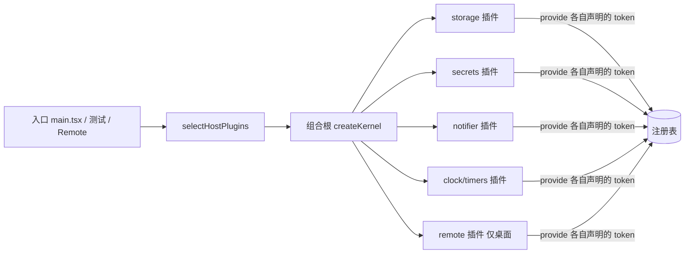

# CORE-02 · 宿主插件与组合根

状态：已自测通过、待审阅（2026-09-13 复核：逐 AC 证据已审，定向测试复跑全绿，REVIEWED_AUTO；见 [验收报告](../reports/CORE-02_ACCEPTANCE.md)）。

## 目标与边界

- 输入：运行宿主（Tauri 桌面 / 浏览器 dev / 测试）、已有存储与密钥实现。
- 输出：三组宿主插件、`selectHostPlugins()`、组合根装配函数，以及分散在各模块的平台端口 token。
- 前置：CORE-01 通过。不依赖 Runtime 是否已服务化。
- 负责范围：新增 `src/app/hosts/`（只放宿主插件与平台判断）与 `src/app/composition.ts`；在 `services/storage/`、`services/remote/` 等各自目录下新增 `tokens.ts`；改造 `services/storage/index.ts` 的暴露方式；`useCompanionSession` 的通知改走 `Notifier` 服务；新增 `storage.conformance.ts`、`secretStore.conformance.ts` 两份共用用例包。
- 不做：**不定义 `HostCapabilities` 这类能力总表**，不建任何汇总 token 的桶文件；不改存储的 SQL、表结构与迁移逻辑；不改对话编排；不动语音与记忆的装配（留给 CORE-05）。

## 架构与接口设计

现在「我在哪个平台」被写在三处：`services/storage/index.ts` 的 `inTauri()`、`useCompanionSession.ts:112` 的 `notify()`、`services/remote/bridge.ts` 的可用性判断。本 SPEC 把这类判断收敛到一个函数，并且**不用一个总表把它们再绑回一起**。



平台端口是**普通服务**，不是内核概念。token 与接口同域定义，按 [内核架构](../ARCHITECTURE.md) 第六、七节：

```ts
// services/storage/tokens.ts —— 与 AikaStorage / SecretStore 同域
export const StorageToken = token<AikaStorage>("storage.aika");
export const SecretStoreToken = token<SecretStore>("storage.secrets");
export const SettingsToken = token<SettingsStore>("storage.settings");

// services/notification/tokens.ts
export const NotifierToken = token<Notifier>("notification.notifier");

export interface Notifier {
  /** 无权限或宿主不支持时返回 false，不抛错——通知失败不该影响已落库的消息。 */
  notify(input: { title: string; body: string }): Promise<boolean>;
}

/** 全仓唯一允许判断平台的函数；返回插件，不返回能力。 */
export function selectHostPlugins(): readonly AikaPlugin[];
```

必须逐条满足的约束：

- 平台判断只允许出现在 `src/app/hosts/detect.ts` 里，`selectHostPlugins()` 据它选插件集合。全仓其它生产文件不得再出现 `__TAURI_INTERNALS__` 判断，宿主实现自身与测试除外。
- **能力缺失即 token 不注册。** 浏览器宿主不注册 `RemoteHostToken`；消费方在 `optional` 里声明并 `tryResolve`，拿到 null 就降级、隐藏入口。不设 `host.remote?` 这类可选字段，也不注册一个「假装存在但会抛错」的实现。
- `openStorage()` 的现有行为（Tauri 走 SQLite、否则 localStorage、首启做 localStorage→SQLite 迁移并清除明文 Key）**逐条保持不变**，只是改由宿主插件提供。迁移仍由 `MIGRATION_FLAG` 保证只跑一次；换装配方式不得导致重跑或跳过。
- `secretStore` 从模块级单例导出改为经 token 提供，但保留原有具名导出作为转发并标注 deprecated，本阶段不要求所有调用方改完。
- `SettingsStore` 收敛 `SETTING_KEYS` 的读写与 JSON 解析失败回退（现散在 `useCompanionSession` 的 bootstrap 里）：解析失败一律回落默认值并记一次诊断，不把坏值写回存储。
- 组合根只负责「装哪些插件」，不含任何业务判断；它是全仓唯一允许调用 `registry.resolve` 的三类文件之一（见 CORE-01-D 白名单）。

## 实施内容与验收条件

交付宿主插件与组合根，把平台判断从业务代码里拿走，且不引入任何能力总表、不改变既有存储行为。

| AC | 模块内验收 |
| --- | --- |
| CORE-02-A | 三种宿主装配后可解析出 storage、secrets、settings、notifier、clock、timers；桌面宿主注册 `RemoteHostToken`、浏览器宿主不注册，消费方 `tryResolve` 拿到 null 后降级不报错 |
| CORE-02-B | 存储行为不变：既有 `storageCompatibility.test.ts`、`sqliteStorage.test.ts`、`messagePersistence.test.ts` 在新装配下全部通过；localStorage→SQLite 迁移仍只跑一次，重复启动不重复写入，明文 Key 迁移后被清除 |
| CORE-02-C | 平台判断收敛：静态扫描生产代码，`__TAURI_INTERNALS__` 只出现在 `src/app/hosts/` 之下，出现在别处即 FAIL |
| CORE-02-D | 无能力总表：静态扫描确认不存在 `HostCapabilities` 之类聚合接口，且没有任何文件导出跨越两个以上模块目录的 token；CORE-01-C 的内核零业务词汇扫描重跑仍通过 |
| CORE-02-E | 通知降级：无权限 / 抛错 / 未注册 Notifier 三种情况下调用方拿到 false 或 null 并继续，消息落库与状态不受影响 |
| CORE-02-F | 设置读写：坏 JSON、缺字段、未知模式值均回落默认值且不写回坏值；`SETTING_KEYS` 的每个键有读写往返测试 |
| CORE-02-G | 实现可替换：`sqliteStorage` 与 `localStorageStorage`、两种 `SecretStore` 实现各自跑**同一份**用例包全绿；`unsupported` 声明与实际行为一致（声明不支持的确实以约定方式不支持，未声明的必须支持）；用例包不断言 SQL 语句或 localStorage 键名 |

## 模块内执行与交付

1. 先确认上述接口与负责范围，再实现当前 SPEC；不要顺带执行下一份 SPEC。
2. 对本次修改的生产逻辑准备定向测试名单。只 mock 外部依赖，不 mock 本模块被验收逻辑；无需启动其他模块。
3. 报告每条 AC 的测试文件/样本、真实命令及退出码，质量样本标明实际模型或 fixture。证据不足保留 NOT RUN/BLOCKED，不能降低门槛。
4. 交付 `../reports/CORE-02_ACCEPTANCE.md`；原任务审阅证据。只在 [集成触发条件](../../integration/SPEC.md) 满足时安排全流程调试，当前小 SPEC 不默认跑全仓测试或产品打包。

CORE-02-G 的用例包形状与「不许稀释」的三条对策见 [端口一致性增量计划](../CONFORMANCE_PLAN.md)；本阶段只落地存储与密钥两份，不新造接口。共享规则见 [模块测试规则](../../modules/TESTING.md)；输入输出遵循 [共享契约](../../modules/CONTRACTS.md)。
