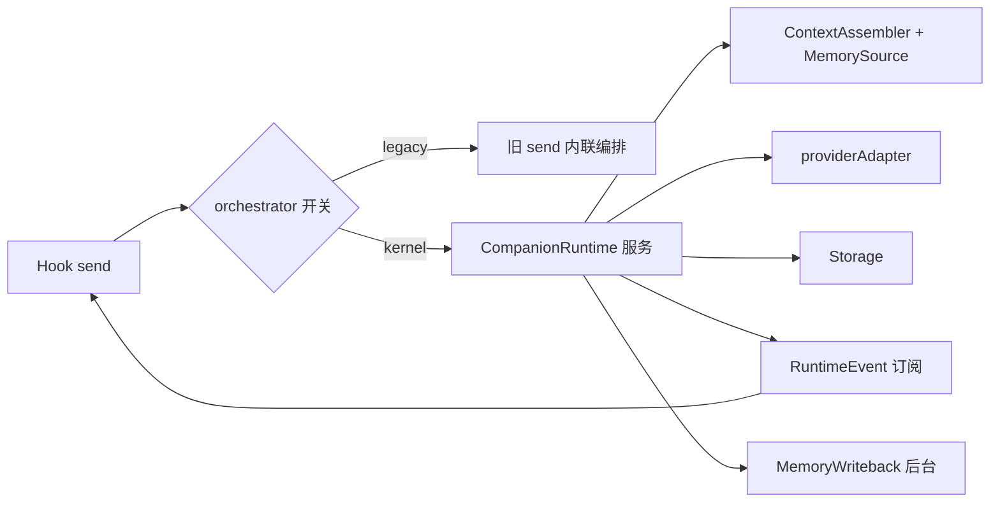

# CORE-03 · Runtime 服务化与编排单一化

状态：未开始。

## 目标与边界

- 输入：注册表里的 provider、storage、memory、context sources、clock、timers；用户提交的文本与语音回合请求。
- 输出：注册表中唯一的 `CompanionRuntime` 服务；`useCompanionSession` 改为消费 Runtime 事件；编排开关与迁移证据。
- 前置：CORE-02 通过。
- 负责范围：`services/runtime/*` 的装配、`services/memory/memorySource|writeback` 的接入、`hooks/useCompanionSession.ts` 的 `send()` 迁移、消息落库字段兼容。
- 不做：不改 `CompanionRuntime` 已验收的 turn 状态机语义；不改 Provider 协议解析；不重构 UI 组件（留给 CORE-04）；不新增外部工具或动作。

这是本模块唯一的高风险 SPEC。它要处理的是一个事实：**`createCompanionRuntime`、`createMemorySource`、`createMemoryWriteback` 目前都没有生产调用方**，应用真正在跑的是 `useCompanionSession.ts:351` 那个约 330 行的 `send()`。两条路径的行为差异必须靠测试暴露，而不是靠阅读判断。

## 架构与接口设计



沿用 `services/runtime/companionRuntime.ts` 已有的 `SubmitRequest` / `TurnHandle` / `RuntimeEvent` / `DeliveryReceipt` 定义，本 SPEC 不改其语义。新增的只有装配与桥接：

```ts
/** 语音回合与 Runtime turn 的对应关系，替代 Hook 里的 requestSeq/busyRef 私有计数。 */
interface VoiceTurnBinding {
  runtimeTurnId: string;
  /** 已持久化字段沿用 number；不得改写旧数据语义。 */
  legacyTurnId?: number;
}

/** 迁移期开关：设置项 core.orchestrator，值为 legacy | kernel。 */
type OrchestratorMode = "legacy" | "kernel";
```

必须逐条满足的迁移约束：

- **开关与默认值。** 本 SPEC 交付时默认 `legacy`；只有在 AC 全部 PASS 且验收报告记录后，才把默认值改成 `kernel`。默认值翻转写在同一份报告里，不另开 SPEC。开关只读一次，不支持运行中热切换——中途切换会让在途 turn 归属不清。
- **turnId 兼容。** `ChatMessage.turnId` 现为 `number`（`domain/voiceRuntime.ts:54` 的语音回合号），Runtime 的 turnId 是 string。新增 `runtimeTurnId?: string`，`turnId` 保持 number 且可缺省。读旧库不得报错，不得把缺失当 0，不得回填假值。
- **单活动轮与打断。** 沿用 Runtime 的「新 submit 先取消旧轮」；Hook 里的 `busyRef` / `requestSeqRef` / `activeRequestRef` 三个私有计数在 kernel 路径下不再参与判定，由 Runtime 的 revision 负责作废迟到结果。
- **生成完成 ≠ 已交付。** 文本轮生成完即落库；语音轮进入 `awaitingDelivery`，靠 `reportDelivery` 结算。拿不到真实播放范围写 `unknown`，不得因为迁移把未交付文本记成完整历史。中断片段仍标 `interrupted` 且带 `playbackStatus`。
- **主动消息。** 现走 `sendChat` 的 proactive 路径（`useCompanionSession.ts:557`）并入 Runtime 的 `source: "proactive"`，配额与冷却判定仍由 `domain/proactive.ts` 负责，不迁进 Runtime。
- **记忆抽取与摘要。** 现在在 Hook 里 `await` 的抽取/摘要改由 `MemoryWriteback` 在正文结算后异步执行，不阻塞回复事件；关闭记忆维护时不得继续提交写入。触发阈值与幂等按 `writeback.ts` 已有实现，本 SPEC 只接线不改策略。
- **失败可见。** Provider 报错、存储写入失败、上下文超预算（`CONTEXT_TOO_LARGE`）都要变成用户看得见的状态，不得静默吞掉后停在 pending。

建议实现：新增 `plugins/runtimePlugin.ts`，声明 `requires` 为 storage / provider / clock / timers、`optional` 为 memory 与各 context source，`provides` 为 `RuntimeToken`；token 定义在 `services/runtime/tokens.ts`，不建汇总模块。Hook 内保留 legacy 分支直到 CORE-06 删除。

## 实施内容与验收条件

交付注册表中唯一的 Runtime 服务与可回滚的编排切换，并用同一份测试证明新旧两条路径行为一致。

| AC | 模块内验收 |
| --- | --- |
| CORE-03-A | 双路径等价：`useCompanionSession.integration.test.ts`、`useCompanionSession.memoryV2.test.ts` 参数化在 legacy 与 kernel 两种模式下各跑一遍且全部通过；任何为迁移而修改的断言在报告中单列原因与替代证据 |
| CORE-03-B | turn 生命周期：kernel 模式下流式增量、完成落库、取消后迟到 chunk 不写入新轮、文本完成不等待播放，与 `companionRuntime.test.ts` 既有断言一致；Hook 私有计数不再参与判定 |
| CORE-03-C | 交付语义：语音轮 complete / interrupted / failed / 无回执超时四种结局分别产生正确的 `completion` 与 `playbackStatus`，未交付文本不被记为完整历史 |
| CORE-03-D | 数据兼容：写入的消息含 `runtimeTurnId`，旧 number `turnId` 不被改写；载入不含新字段的旧库不报错、不回填假值；`storageCompatibility.test.ts` 通过 |
| CORE-03-E | 后台维护：抽取与摘要不阻塞正文事件；关闭记忆维护后不再提交写入；重复触发不重复写入（复用 `writeback.test.ts` 与 `memoryRepository.test.ts`） |
| CORE-03-F | 错误可见：Provider 失败、存储失败、`CONTEXT_TOO_LARGE` 各自产生可展示错误且能再次发送，不残留 busy/pending |
| CORE-03-G | 唯一编排：kernel 模式下静态扫描确认 `hooks/` 不再调用 `streamChat`/`sendChat`（legacy 分支除外，且该分支被开关明确隔离并标注将于 CORE-06 删除） |

## 模块内执行与交付

1. 先确认上述接口与负责范围，再实现当前 SPEC；不要顺带执行下一份 SPEC。
2. 对本次修改的生产逻辑准备定向测试名单。只 mock 外部依赖，不 mock 本模块被验收逻辑；无需启动其他模块。
3. 报告每条 AC 的测试文件/样本、真实命令及退出码，质量样本标明实际模型或 fixture。证据不足保留 NOT RUN/BLOCKED，不能降低门槛。
4. 交付 `../reports/CORE-03_ACCEPTANCE.md`；原任务审阅证据。只在 [集成触发条件](../../integration/SPEC.md) 满足时安排全流程调试，当前小 SPEC 不默认跑全仓测试或产品打包。

本 SPEC 改变共享契约（消息字段与 Runtime 消费方），按 [集成 SPEC](../../integration/SPEC.md) 在 INT-01 登记受影响消费者：前端桥接、Remote 手机入口、LLM-04 后台维护。共享规则见 [模块测试规则](../../modules/TESTING.md)；输入输出遵循 [共享契约](../../modules/CONTRACTS.md)。
