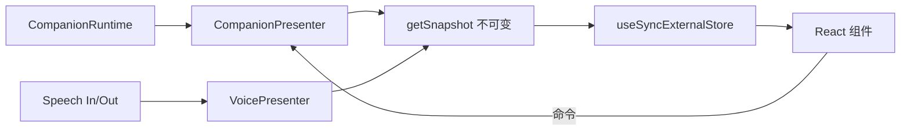

# CORE-04 · Presenter 层与 Hook 降级

状态：未开始。

## 目标与边界

- 输入：注册表里的 Runtime、settings、stickers、语音引擎；用户在界面上的操作。
- 输出：`CompanionPresenter` 与 `VoicePresenter` 服务、只做订阅与派发的 Hook、不可变视图快照。
- 前置：CORE-03 通过且默认已切到 kernel。
- 负责范围：新增 `src/presentation/`；改写 `hooks/useCompanionSession.ts`、`hooks/useVoiceConversation.ts`；`App.tsx` 改为通过 `KernelProvider` / `useService` 取依赖。
- 不做：不改视觉样式与组件结构；不改语音引擎实现与队列策略；不引入状态管理库。

## 架构与接口设计

`CompanionPresenter` 沿用 [前端架构](../../frontend/ARCHITECTURE.md) 已定义的契约，本 SPEC 负责实现它，不另立一套。



```ts
/** React 侧唯一的取依赖入口；resolve 白名单只允许它、组合根与插件 activate。 */
function useService<T>(token: ServiceToken<T>): T;

interface VoicePresenter {
  getSnapshot(): VoiceViewModel;   // phase / captions / level / error
  subscribe(listener: () => void): () => void;
  startListening(): void;
  stopListening(): void;
  interrupt(): void;               // 用户重新开口：Runtime cancel + TTS stop
  dispose(): void;
}
```

约束：

- Presenter 不 import React，能在无 DOM 的 node 环境构造并驱动到完整一轮。这是「多宿主」是否成立的判据。
- `getSnapshot()` 返回不可变引用；状态未变化时必须返回**同一个对象**，否则 `useSyncExternalStore` 会无限重渲染。
- Hook 内只允许三类代码：`useService` 取依赖、订阅快照、把用户操作转成 Presenter 命令。不得在 Hook 里拼提示词、发网络请求、算检索、写库或直接 `new` 引擎。
- `useCompanionSession.ts` 与 `useVoiceConversation.ts` 不得 import `services/` 下的实现模块，只允许 import token 与类型。
- 订阅清理与取消不依赖组件重渲染次数；StrictMode 下双次挂载不得产生重复订阅或重复提交。
- 语音打断链路（用户重新开口 → Runtime cancel → TTS stop → 继续接收 STT）在 Presenter 内编排，用 fake 引擎验收；真实三模块联动仍属 INT-02，不在本阶段启动真实服务。

## 实施内容与验收条件

交付展示层与运行层的分离：业务状态由 Presenter 持有，React 只负责画。

| AC | 模块内验收 |
| --- | --- |
| CORE-04-A | 无 React 环境下用 fake Runtime 驱动 `CompanionPresenter` 走完流式/完成/失败/取消四种序列，快照序列正确，旧 turn 事件不覆盖新消息 |
| CORE-04-B | 快照稳定性：无状态变化时 `getSnapshot()` 返回同一引用；连续增量只产生与增量数相当的快照变更，不产生每帧全量重建 |
| CORE-04-C | Hook 瘦身可度量：`useCompanionSession.ts` 与 `useVoiceConversation.ts` 均不 import `services/` 实现模块（静态扫描），`useCompanionSession.ts` 行数不超过 150 行，违反即 FAIL |
| CORE-04-D | 订阅生命周期：挂载/卸载/重开与 StrictMode 双次挂载下无重复订阅、无重复提交、无泄漏计时器；dispose 后再收到迟到事件不更新快照 |
| CORE-04-E | 语音打断：fake STT/TTS 下「用户重新开口」触发 Runtime cancel 与 TTS stop，且 STT 继续接收；已展示片段标 interrupted，不伪装成完整回复 |
| CORE-04-F | 现有 UI 行为不回归：既有前端相关测试通过；发送、流式展示、错误后重发、模式设置反馈与迁移前一致 |

## 模块内执行与交付

1. 先确认上述接口与负责范围，再实现当前 SPEC；不要顺带执行下一份 SPEC。
2. 对本次修改的生产逻辑准备定向测试名单。只 mock 外部依赖，不 mock 本模块被验收逻辑；无需启动其他模块。
3. 报告每条 AC 的测试文件/样本、真实命令及退出码，质量样本标明实际模型或 fixture。证据不足保留 NOT RUN/BLOCKED，不能降低门槛。
4. 交付 `../reports/CORE-04_ACCEPTANCE.md`；原任务审阅证据。只在 [集成触发条件](../../integration/SPEC.md) 满足时安排全流程调试，当前小 SPEC 不默认跑全仓测试或产品打包。

本 SPEC 实现 [前端架构](../../frontend/ARCHITECTURE.md) 的 Presenter 契约，与 FE-01 的交付范围重叠：执行时先确认由本 SPEC 交付、FE-01 只做消费与视图验收，避免两份重复实现。共享规则见 [模块测试规则](../../modules/TESTING.md)；输入输出遵循 [共享契约](../../modules/CONTRACTS.md)。
