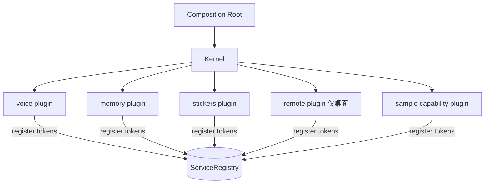

# CORE-05 · 插件契约与能力注册

状态：未开始。

## 目标与边界

- 输入：已服务化的 Runtime、Presenter、宿主能力；现有语音、记忆、表情包、Remote 四组能力。
- 输出：四个能力插件、能力清单与降级规则、一个证明扩展点可用的示例插件。
- 前置：CORE-04 通过。
- 负责范围：`src/kernel/plugins/` 下的 voice / memory / stickers / remote 插件；能力可用性与降级判定；示例插件与扩展点测试；新增 `speechInput.conformance.ts`、`speechOutput.conformance.ts` 两份共用用例包。
- 不做：**不实现抓屏、情感识别、Live2D、Three.js、Unity**；不做运行期热插拔、插件沙箱或第三方插件加载；不改各能力的既有算法。

本 SPEC 的目的不是「把文件挪个位置」，而是给出一个可证伪的结论：**加一个新能力，需要改内核吗？** 如果需要，说明前四份 SPEC 没做到位。

## 架构与接口设计

插件契约以 [内核架构](../ARCHITECTURE.md) 的「插件契约」为准。补充约束：

- 每个插件声明 `requires`/`provides` 并与实际注册**完全一致**：少注册或多注册都判激活失败。
- 插件之间不得直接 import 对方模块，只通过 token 通信。
- 能力缺失是常态而不是错误：浏览器宿主没有 Remote、无麦克风权限时没有 STT、清单为空时没有表情包。缺失时对应 token 不注册，消费方用 `tryResolve` 降级，界面隐藏相应入口，不弹错误、不阻断启动。
- 语音插件保留现有装配行为：`createInputEngine` 的 auto / whisper-local / web-speech 选择与回退不变，`createSpeechQueue` 的队列与 stop 语义不变，只是改由插件注册而不是在 Hook 里 `new`。
- 记忆插件负责 `MemoryV2Store` 缺失时退回 V1 的现有逻辑，以及旧记忆迁移仍然幂等。
- Remote 插件只在桌面宿主的插件集合里；缺失时 `RemoteHostToken` 根本不注册，消费方按 `optional` + `tryResolve` 降级。手机端提交的一轮仍复用桌面同一个 Runtime 实例，不得另建第二个 Runtime——那会重新制造双编排。
- 示例插件必须是**功能上的空操作**：注册一个 no-op 能力 token，用来证明扩展点，不引入任何新行为、不写存储、不发请求。

## 实施内容与验收条件

交付能力插件化与一个可证伪的扩展点。

| AC | 组内验收 |
| --- | --- |
| CORE-05-A | 四个能力插件的 `requires`/`optional`/`provides` 与实际行为一致；故意少注册一个已声明 token、或 `provide` 一个未声明 token、或 `resolve` 一个未声明依赖，三种情况分别触发激活失败并按逆序回滚，state 置 `failed`，不留半启动状态 |
| CORE-05-B | 能力降级：无 Remote（浏览器宿主）、无麦克风权限、表情包清单为空三种情况下应用正常启动、对应入口隐藏、不弹错误；相关既有测试通过 |
| CORE-05-C | 扩展点可证伪：新增示例插件的 diff **只含新文件加一行注册**，`src/kernel/`（内核本体）与 `App.tsx` 零改动；用 diff 统计作为证据 |
| CORE-05-D | 单一 Runtime：桌面宿主下 Remote 与本地 UI 解析到同一个 Runtime 实例（同一性断言），手机提交的一轮进入同一条 turn 生命周期 |
| CORE-05-E | 行为不回归：语音队列与输入引擎的既有测试（`speechQueue.test.ts`、`webSpeechInput.test.ts`、`whisperClient.test.ts`、`voiceDiagnostics.test.ts`）在插件装配下全部通过 |
| CORE-05-F | 插件隔离：静态扫描确认插件之间无直接 import；内核不 import 任何插件（组合根除外） |
| CORE-05-G | 语音引擎可替换：`webSpeechInput` 与 `whisperInput` 跑**同一份**输入用例包全绿；`webSpeechOutput` 与 `cloudTtsOutput` 跑同一份输出用例包全绿（连续性差异、停止语义、`unsupported` 声明须一致）；用例包用假传输层与固定文本，不启动真实设备或云服务 |

## 模块内执行与交付

1. 先确认上述接口与负责范围，再实现当前 SPEC；不要顺带执行下一份 SPEC。
2. 对本次修改的生产逻辑准备定向测试名单。只 mock 外部依赖，不 mock 本模块被验收逻辑；无需启动其他模块。
3. 报告每条 AC 的测试文件/样本、真实命令及退出码，质量样本标明实际模型或 fixture。证据不足保留 NOT RUN/BLOCKED，不能降低门槛。
4. 交付 `../reports/CORE-05_ACCEPTANCE.md`；原任务审阅证据。只在 [集成触发条件](../../integration/SPEC.md) 满足时安排全流程调试，当前小 SPEC 不默认跑全仓测试或产品打包。

CORE-05-G 的第二个输出实现来自 `stash@{0}` 的 `cloudTtsOutput`：按 [端口一致性增量计划](../CONFORMANCE_PLAN.md) 先经 `git stash branch feat/tts-output` 独立整理，再作为被测实现进来，不直接 pop 回主线。共享规则见 [模块测试规则](../../modules/TESTING.md)；输入输出遵循 [共享契约](../../modules/CONTRACTS.md)。
