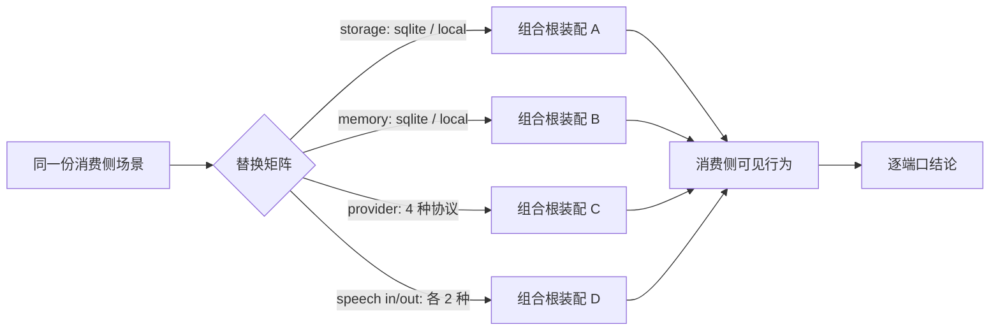

# CORE-07 · 端口一致性与实现可替换性收口

状态：已自测。A–F 六条 AC：五个双实现端口（storage / secrets / memory / provider / speech-in）与 ContextSource 的矩阵、突变验证、零改动证据均 PASS；**输出侧（SpeechOutputEngine）BLOCKED**——SPEC 前置 CORE-05-G 因缺第二实现未整体 PASS，矩阵该格只有单实现可比。证据见 [验收报告](../reports/CORE-07_ACCEPTANCE.md)。

## 目标与边界

- 输入：CORE-02/03/05 已就地落地的各端口共用用例包、各端口的现有实现、组合根。
- 输出：替换矩阵的执行结果、消费侧零改动的 diff 证据、逐端口的可替换性结论。
- 前置：CORE-06 通过（编排单一、旧路径已下线），且 CORE-02-G / CORE-03-H / CORE-03-I / CORE-05-G 四条 AC 均已 PASS。
- 负责范围：替换矩阵的驱动测试、组合根的实现选择参数化、结论报告。
- 不做：**不新造任何端口接口**；不写新的生产实现；不改消费侧代码；不做运行期热替换；不做跨端口联动（那是 INT-01/02）。

方案背景见 [端口一致性增量计划](../CONFORMANCE_PLAN.md)。本 SPEC 只回答一个问题：**换实现，消费侧真的不用改吗？**

## 架构与接口设计

用例包与端口接口在 CORE-02/03/05 就已经存在，本阶段不新增。这里只加一个驱动：同一份消费侧场景，跑在不同的实现组合上。



```ts
/** 矩阵的一格：只描述「装哪个实现」，不描述「怎么用」。 */
interface SwapCase {
  port: string;
  implementation: string;
  /** 组合根据此选插件；消费侧代码对此一无所知。 */
  hostPlugins: readonly AikaPlugin[];
}

/** 消费侧场景：只依赖端口契约，不依赖任何具体实现。 */
interface ConsumerScenario {
  name: string;
  run(kernel: AikaKernel): Promise<ConsumerObservation>;
}
```

约束：

- 消费侧场景在所有格子里**逐字相同**，不允许按实现分支。出现 `if (impl === "sqlite")` 就说明抽象没成立，该格判 FAIL 而不是加个分支绕过去。
- 「消费侧可见行为一致」指端口契约上可观测的结果一致；允许的差异必须事先出现在该实现的 `unsupported` 声明里。临时在断言里加例外等同于稀释用例包。
- 实现选择只经组合根。矩阵驱动不得直接 `new` 某个实现塞进注册表——那样测的是测试代码，不是产品的装配路径。
- 用例包只测单端口契约；本 SPEC 也只测「换掉一个端口」。同时换多个端口属于组合爆炸，不做。

## 实施内容与验收条件

交付替换矩阵与逐端口结论，把「可替换」从主张变成证据。

| AC | 模块内验收 |
| --- | --- |
| CORE-07-A | 用例包一致性：每个有 ≥2 个真实实现的端口，其全部实现跑**同一份**用例包全绿；`unsupported` 声明与实际行为一致（声明不支持的确实以约定方式不支持，未声明的必须支持） |
| CORE-07-B | 替换矩阵：同一份消费侧场景在矩阵每一格下产生一致的消费侧可见行为；场景代码逐字相同，无按实现分支 |
| CORE-07-C | 消费侧零改动：切换任一端口实现的改动，`git diff --name-only` 只落在组合根/宿主插件选择文件上，消费侧文件 0 改动；证据附在报告里 |
| CORE-07-D | 用例包不可稀释：对每个端口，把某个实现的一条真实行为改坏，对应用例必须失败（突变验证，沿用 CORE-01 的做法）；全部改回后复跑全绿 |
| CORE-07-E | 结论如实：报告逐端口写明「几个真实实现 / 是否跑同一份用例 / 切换需改哪些文件」；只有一个真实实现的端口（如 `ContextSource`）明确标注可替换性证据弱，不与其他端口混为一谈 |
| CORE-07-F | 边界如实：报告写明用例包证明的是行为契约可替换，**不**证明性能、并发与持久性等价；不得以全绿暗示两个实现可随意互换 |

## 模块内执行与交付

1. 先确认上述接口与负责范围，再实现当前 SPEC；不要顺带执行下一份 SPEC。
2. 对本次修改的生产逻辑准备定向测试名单。只 mock 外部依赖，不 mock 本模块被验收逻辑；无需启动其他模块。
3. 报告每条 AC 的测试文件/样本、真实命令及退出码，质量样本标明实际模型或 fixture。证据不足保留 NOT RUN/BLOCKED，不能降低门槛。
4. 交付 `../reports/CORE-07_ACCEPTANCE.md`；原任务审阅证据。只在 [集成触发条件](../../integration/SPEC.md) 满足时安排全流程调试，当前小 SPEC 不默认跑全仓测试或产品打包。

本 SPEC 不改共享契约，只验证既有契约是否真的成立。共享规则见 [模块测试规则](../../modules/TESTING.md)；输入输出遵循 [共享契约](../../modules/CONTRACTS.md)。
