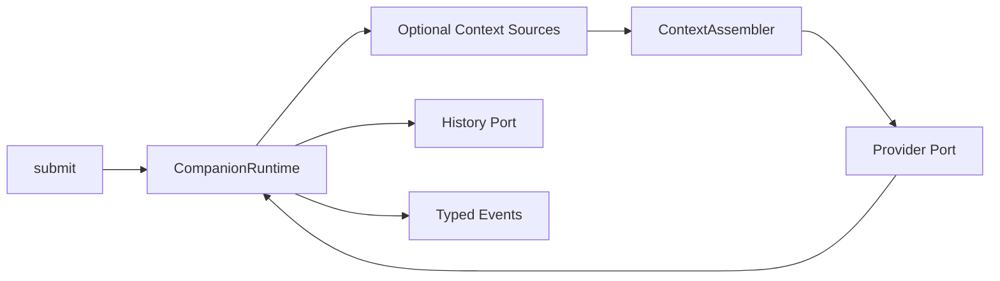

# LLM-02 · Runtime 与 Context

状态：已自测 4 文件/46 测试通过；真实模型样本与 Hook 接入 NOT RUN；待审阅，不新增完成声明（2026-09-13 复核补记）。

## 目标与边界

- 输入：文本、Mode、时钟、存储、可选上下文源、输入预算。
- 输出：可订阅 Runtime 事件、AgentContext、来源/裁剪/降级 trace。
- 前置：依赖 LLM-01 的类型契约，可用兼容 adapter；真实 UI/STT/TTS 不前置。
- 负责范围：拟新增 services/runtime、services/context、domain/context；通过 adapter 保留既有入口。
- 不做：不实现前端桥接页面、新 ASR/TTS 或完整 Memory/RAG。

## 架构与接口设计

Runtime 是模块内编排层，不引用 React、浏览器 UI 或具体 TTS。ContextAssembler 是确定性纯装配层，Provider/Storage/Clock/ContextSource 通过端口注入。



下列为拟实现的逻辑契约；可调整名称，语义及测试不可省略。引用的 ModeConfig/ReplyEnvelopeV1 沿用 LLM-01。

```ts
type TurnState = "assembling" | "generating" | "awaitingDelivery"
  | "completed" | "cancelled" | "failed";
interface SubmitRequest {
  text: string;
  source: "text" | "voice" | "proactive";
  mode: ModeConfig;
}
interface TurnHandle {
  turnId: string;
  done: Promise<{ state: "completed" | "cancelled" | "failed"; errorCode?: string }>;
}
interface RuntimeEvent {
  turnId: string;
  seq: number;
  type: "state" | "replyDelta" | "generated" | "settled" | "error";
  // 实现时写成 discriminated union，禁止调用者猜 payload。
}
interface CompanionRuntime {
  submit(request: SubmitRequest): TurnHandle;
  cancel(turnId: string): void;
  reportDelivery(event: DeliveryReceipt): void;
  subscribe(listener: (event: RuntimeEvent) => void): () => void;
  dispose(): void;
}
interface DeliveryReceipt {
  turnId: string;
  status: "complete" | "interrupted" | "failed";
  deliveredText?: string;
  precision: "confirmed" | "proxy" | "unknown";
}
interface ContextSource<T> {
  load(input: { query: string; now: number; signal: AbortSignal }): Promise<T>;
}
```

实现 RuntimeEvent 为如下负载：state 含 state；replyDelta 含 text；generated 含完整 reply；settled 含终态；error 含 code/retryable。seq 每轮递增，订阅异常隔离，done 终态恰好结算一次。Provider 接收 assembled context 与 AbortSignal，返回 AsyncIterable 的解析事件；网络尝试计数留给 LLM-04。

- 单会话最多一个活动生成轮；新 submit 先取消旧轮再生成新 turnId。空文本/已 dispose 的调用返回明确输入错误，不建立半活跃轮。
- 状态：assembling→generating→completed（文字）；语音 generated 后进入 awaitingDelivery，收到交付通知才结算。任意非终态可取消/失败；终态不可被迟到回调改写。语音交付等待采用注入超时策略，默认 30 秒无进度进入 failed，不无限占 busy；设备实测调整放集成阶段。
- 生成正文与持久化成功是不同事件。取消与异步写入竞争通过 turn revision/写入串行化处理；存储完成前再验证有效轮次，不能仅在调用前检查。已提交的中断片段允许存在，但不得写作完整历史。
- ContextSource 并行限时读取，默认各 300ms，可注入假时钟；取消时终止读取。超时源不影响其他源。Assembler 不发网络请求；必需内容超预算返回 CONTEXT_TOO_LARGE。
- AgentContext 字段沿用总 PRD；预算含 inputLimit、outputReserve、safetyReserve，结果包含 estimatedTokens 与 droppedSources。无 tokenizer 时显式估算，不能承诺 Provider 精确 token 数。

建议文件：`services/runtime/companionRuntime.ts`、`services/context/contextAssembler.ts`、`domain/context.ts`；已有 Hook 通过 adapter 兼容，不同时重做 UI。LLM-02-A/D 用确定性调度测试取消/持久化竞争及超时，LLM-02-B/C 测纯装配与源失败。

## 实施内容与验收条件

交付独立 React 的 CompanionRuntime；注入 Provider/Storage/Clock 和检索源，统一 turn 生命周期、取消、存储与状态订阅。AgentContext 含时间、Soul、关系、Mode、近期历史/摘要、Memory/Knowledge/环境数据。Hook 接入若需跨前端修改，由 FE-01/INT-01 消费适配；本阶段先验 headless 生产逻辑。

| AC | 模块内验收 |
| --- | --- |
| LLM-02-A | 无 React、麦克风或 TTS 时可流式回复、完成落库；取消后迟到 chunk 不影响新轮，文本完成不等待播放 |
| LLM-02-B | 固定输入/时钟产生稳定 Context；用户时区与跨午夜正确；估算 token 不超过预算，必需内容超限显式报错 |
| LLM-02-C | Memory/RAG/环境数据源各自超时/抛错时仍可回复并记录降级原因，不注入错误文本或将检索内容提升为指令 |
| LLM-02-D | 交付状态用 fixture 模拟：complete/interrupted/cancelled 与未知播放范围不会把未交付文本当已听完；旧消息迁移不丢失 |

## 模块内执行与交付

1. 先确认上述接口与负责范围，再实现当前 SPEC；不要顺带执行下一份 SPEC。
2. 对本次修改的生产逻辑准备定向测试名单。只 mock 外部依赖，不 mock 本模块被验收逻辑；无需启动其他模块。
3. 报告每条 AC 的测试文件/样本、真实命令及退出码，质量样本标明实际模型或 fixture。证据不足保留 NOT RUN/BLOCKED，不能降低门槛。
4. 交付 `../reports/LLM-02_ACCEPTANCE.md`；原任务审阅证据。只在 [集成触发条件](../../integration/SPEC.md) 满足时安排全流程调试，当前小 SPEC 不默认跑全仓测试或产品打包。

共享规则见 [模块测试规则](../../modules/TESTING.md)；输入输出遵循 [共享契约](../../modules/CONTRACTS.md)。
