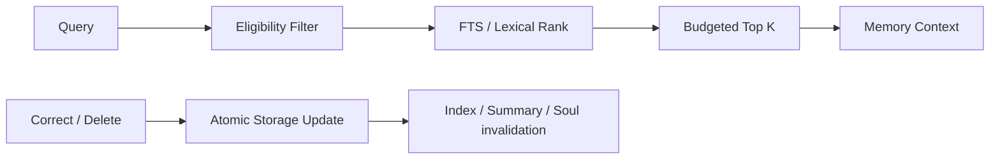

# LLM-03 · Memory 与 User Soul

状态：未开始。

## 目标与边界

- 输入：用户事实与来源、查询、当前时间、预算、旧记录。
- 输出：可检索记忆、更新/删除结果、带来源的 UserSoul。
- 前置：依赖 Context 的 memories 接口；没有 Runtime 时用模块 harness 注入。
- 负责范围：domain/memory、services/memory、services/storage 的记忆接口与迁移。
- 不做：不新增模型实时分析调用、向量库或全产品界面。

## 架构与接口设计



```ts
interface MemoryRecordV2 {
  schemaVersion: 2;
  id: string;
  type: "fact" | "preference" | "event" | "goal" | "relationship";
  content: string;
  sourceMessageIds: string[];
  sourceKind: "messages" | "legacy" | "userEdit";
  status: "candidate" | "confirmed" | "superseded";
  confidence: number | null; // [0,1]；null=unknown
  importance: number; // [0,1]，旧数据默认0.5
  createdAt: number;
  updatedAt: number;
  lastConfirmedAt: number | null;
  lastAccessedAt: number | null;
  validFrom: number | null;
  validUntil: number | null;
  supersedesId?: string;
}
interface MemoryQuery { text: string; now: number; limit: number; tokenBudget: number; }
interface MemoryHit {
  record: MemoryRecordV2;
  score: number;
  reasons: string[];
  temporalStatus: "current" | "past";
}
interface MemoryRepository {
  retrieve(query: MemoryQuery): Promise<MemoryHit[]>;
  upsert(records: readonly MemoryRecordV2[]): Promise<void>;
  supersede(oldId: string, next: MemoryRecordV2): Promise<void>;
  forget(id: string): Promise<void>;
}
```

过滤排除 superseded；过期 event 可标 past，其它过期事实不作当前事实。检索分数归一后默认 `0.7*relevance + 0.2*recency + 0.1*importance`，recency 使用实际事件/确认/创建时间，不能因刚访问就变新事实。算法、归一方式和阈值在代码中版本化；先固定测试集再校准阈值，无相关匹配返回空集。

SQLite 存储、FTS 索引与替代关系须事务化；localStorage 降级采用单次快照替换，失败保持旧快照。原 pending→candidate，保留旧 category 映射，不伪造 sourceMessageIds。迁移版本在事务最后更新，重复运行幂等。

forget 原子清除记录/索引，失效相关摘要、Soul 和缓存，保存最小来源抑制标记防止旧来源重新抽取；不保留已删除正文在抑制记录。无法溯源的旧摘要保守失效。用户新明确输入可成为新来源，不因内容相同永久禁止用户重新记忆。

User Soul 使用 LLM-01 的 SourcedValue；自动晋升要求两个不同 sourceMessageIds 的相容证据；批次重放不算第二份证据。用户编辑/纠正优先，候选置信度不等于确认。LLM-03-B/C 覆盖事务失败、恢复、删除与后台重试。

## 实施内容与验收条件

交付来源/类型/重要度/置信度/有效期/访问时间及 candidate/confirmed/superseded 状态；SQLite FTS5/BM25+recency+importance，浏览器可见词法降级。去重、更正、删除联动摘要/画像；原始重复来源不能让删除记忆复活。至少两轮独立证据才自动晋升画像，明确用户纠正可直接生效。

| AC | 模块内验收 |
| --- | --- |
| LLM-03-A | 固定 ≥30 条记忆、20 个问题：15 个有答案中 ≥13 个 Top-5 命中，5 个无答案不硬塞无关内容；覆盖三语 |
| LLM-03-B | 更正与有效期优先规则可解释；访问不自动确认；删除→重载→抽取不复活，旧库迁移两次无丢失/重复 |
| LLM-03-C | 单候选/重复来源不覆盖画像；两个独立证据可沉淀；明确用户纠正生效且来源保留 |
| LLM-03-D | 10 个跨会话文本样本 ≥8 个正确自然引用事实，伪造来源或把未确认当已确认为 0 |

## 模块内执行与交付

1. 先确认上述接口与负责范围，再实现当前 SPEC；不要顺带执行下一份 SPEC。
2. 对本次修改的生产逻辑准备定向测试名单。只 mock 外部依赖，不 mock 本模块被验收逻辑；无需启动其他模块。
3. 报告每条 AC 的测试文件/样本、真实命令及退出码，质量样本标明实际模型或 fixture。证据不足保留 NOT RUN/BLOCKED，不能降低门槛。
4. 交付 `../reports/LLM-03_ACCEPTANCE.md`；原任务审阅证据。只在 [集成触发条件](../../integration/SPEC.md) 满足时安排全流程调试，当前小 SPEC 不默认跑全仓测试或产品打包。

共享规则见 [模块测试规则](../../modules/TESTING.md)；输入输出遵循 [共享契约](../../modules/CONTRACTS.md)。
