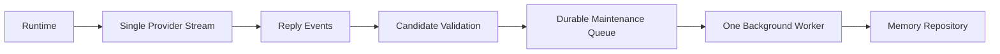

# LLM-04 · 单次生成与后台维护

状态：未开始。

## 目标与边界

- 输入：已校验的成功回复、候选、turnId、维护配置。
- 输出：幂等落库、后台批次状态、真实/后台请求计数。
- 前置：依赖候选 Schema、Memory 写入接口；其他模块使用 stub。
- 负责范围：CompanionRuntime、Provider 请求计量、后台 memory 队列。
- 不做：不新增外部动作工具、不开发 TTS 或设备链路。

## 架构与接口设计



```ts
interface MaintenanceBatch {
  id: string;
  sourceTurnIds: string[];
  sourceMessageIds: string[];
  status: "pending" | "running" | "done" | "failed";
  attempts: number;
  nextAttemptAt: number;
}
interface MemoryMaintenance {
  enqueue(input: { turnId: string; sourceMessageIds: string[];
    candidates: readonly MemoryCandidate[] }): Promise<void>;
  flush(reason: "turnThreshold" | "sessionEnd" | "idle"): Promise<void>;
  setEnabled(enabled: boolean): void;
  dispose(): void;
}
interface RequestMetric {
  turnId: string;
  purpose: "foreground" | "maintenance";
  attempt: number;
  status: "started" | "completed" | "failed" | "cancelled";
}
```

候选来自已完成的有效轮次，绑定用户来源；被取消轮不入队。缺置信度保留 unknown，候选不能直接成为 confirmed；简单候选校验/去重可本地完成，不额外调用实时模型。MemoryCandidate 在 LLM-03 Schema 与旧 LLM-01 category/content 之间通过显式 adapter 转换。

队列操作不阻塞正文流；每 8 成功轮或 session end 触发后台，单 worker。稳定批次 ID 由有序来源集合+策略版本决定，来源唯一键避免重复写入；running 批次重启回 pending。可重试错误最多 3 次，指数退避（初值1秒，上限30秒），之后标 failed 待显式重试，不无限循环。

关闭维护递增写入 epoch、停止排程并取消在途调用；事务提交前再次核验 epoch。已提交内容不回滚，尚未提交的旧任务不写入。存储错误只影响维护状态，回复仍完成；日志仅计数与ID，不输出密钥/正文。

Provider 适配负责一次流式请求，首正文前允许受控 fallback，正文后失败不可重放。foreground 与 maintenance 的每次网络尝试都计数，不能用逻辑回合数掩盖重试。LLM-04-A/B/C 通过生产 Runtime + fake Provider/时钟/事务故障验证，无真实 STT/TTS。

## 实施内容与验收条件

交付成功回复内的 memoryCandidates 校验与后台幂等队列，8 个成功轮或 session end 触发合并，后台并发 1、实时优先；actions 默认空，不扩展外部工具。

| AC | 模块内验收 |
| --- | --- |
| LLM-04-A | 20 个正常无工具回合每轮实时生成请求恰好一次；后台和重试分别计量，无分类/情绪/记忆追加实时请求 |
| LLM-04-B | 后台延迟 30 秒不延迟正文事件；重复批次/重启不重复写入，关闭记忆维护后不继续提交写入 |
| LLM-04-C | 断流、取消、畸形候选不会完成非法写回；已出正文后不重放，首正文前降级尝试单独计数 |
| LLM-04-D | 四种 Provider 生产协议 fixture 通过；真实服务联通证据与 fixture 分列，不调用其它模块 |

## 模块内执行与交付

1. 先确认上述接口与负责范围，再实现当前 SPEC；不要顺带执行下一份 SPEC。
2. 对本次修改的生产逻辑准备定向测试名单。只 mock 外部依赖，不 mock 本模块被验收逻辑；无需启动其他模块。
3. 报告每条 AC 的测试文件/样本、真实命令及退出码，质量样本标明实际模型或 fixture。证据不足保留 NOT RUN/BLOCKED，不能降低门槛。
4. 交付 `../reports/LLM-04_ACCEPTANCE.md`；原任务审阅证据。只在 [集成触发条件](../../integration/SPEC.md) 满足时安排全流程调试，当前小 SPEC 不默认跑全仓测试或产品打包。

共享规则见 [模块测试规则](../../modules/TESTING.md)；输入输出遵循 [共享契约](../../modules/CONTRACTS.md)。
