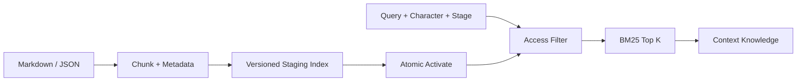

# LLM-05 · Knowledge/Wiki

状态：未开始。

## 目标与边界

- 输入：Markdown/JSON 文档、查询、Mode/角色/关系阶段。
- 输出：过滤后的 chunk、来源引用、Knowledge Context。
- 前置：依赖 knowledge section 契约；可 headless 验证。
- 负责范围：本地知识导入、FTS 索引、检索服务与 Context adapter。
- 不做：不做知识图谱、向量库、网络爬取和全流程语音调试。

## 架构与接口设计



```ts
interface KnowledgeDocument {
  id: string;
  sourcePath: string;
  contentHash: string;
  version: number;
  characterId: string;
  type: "character" | "world" | "oral" | "scenario";
  tags: string[];
  unlockStage: "new" | "familiar" | "close";
}
interface KnowledgeChunk {
  id: string;
  documentId: string;
  section: string;
  text: string;
  order: number;
}
interface KnowledgeQuery {
  text: string;
  characterId: string;
  stage: KnowledgeDocument["unlockStage"];
  mode: ModeId;
  limit: number;
  tokenBudget: number;
}
interface KnowledgeIndex {
  importDocuments(paths: readonly string[]): Promise<{ version: number; count: number }>;
  removeDocument(id: string): Promise<void>;
  retrieve(query: KnowledgeQuery): Promise<readonly KnowledgeHit[]>;
}
// KnowledgeHit = chunk + document metadata + normalized score + source citation。
```

现有关系枚举若不同，边界显式映射，不修改关系评分。角色/解锁过滤必须在 Top-K 之前；缓存键包括 indexVersion、characterId、stage、mode、归一 query、limit、budget。文档更新先写 staging 索引，事务切换 activeVersion 后才对查询可见；失败保留旧版。删除同步索引、缓存与来源引用。

默认按标题/段落切分，超长段限定尺寸并保留 section；相同内容哈希不重复导入。中文/日文使用统一词法归一与切分策略，英语采用词边界；索引和查询必须共用实现，不假定空格分词够用。

检索超时/空结果返回带原因的空知识 section，LLM 回复可继续。引文引用 documentId/chunkId/version，文档内部指令永远是资料，不变成 Runtime 命令。LLM-05-A/B/C 使用临时索引和固定资料验证，不读取私人文件或外部知识服务。

## 实施内容与验收条件

交付 Markdown/JSON 切块、来源/type/tags/unlockStage、FTS/BM25 检索和 Context 注入，覆盖 character/world/oral/scenario；过滤先于 Top-K，关系阶段进入缓存键。无图谱/向量库。

| AC | 模块内验收 |
| --- | --- |
| LLM-05-A | 中日英各 5 个有答案问题 ≥13/15 Top-5 命中；5 个无答案返回无可靠证据 |
| LLM-05-B | 10 个未解锁查询隐藏 chunk 注入数 0，Mode/角色/阶段变化后缓存正确 |
| LLM-05-C | 新增/更新/删除/失败重建无旧索引残留，失败保留上个可用版本；FTS 不可用可见降级 |
| LLM-05-D | 10 个实际文本问答 ≥9 个与来源一致；无伪造来源，无执行知识内指令 |

## 模块内执行与交付

1. 先确认上述接口与负责范围，再实现当前 SPEC；不要顺带执行下一份 SPEC。
2. 对本次修改的生产逻辑准备定向测试名单。只 mock 外部依赖，不 mock 本模块被验收逻辑；无需启动其他模块。
3. 报告每条 AC 的测试文件/样本、真实命令及退出码，质量样本标明实际模型或 fixture。证据不足保留 NOT RUN/BLOCKED，不能降低门槛。
4. 交付 `../reports/LLM-05_ACCEPTANCE.md`；原任务审阅证据。只在 [集成触发条件](../../integration/SPEC.md) 满足时安排全流程调试，当前小 SPEC 不默认跑全仓测试或产品打包。

共享规则见 [模块测试规则](../../modules/TESTING.md)；输入输出遵循 [共享契约](../../modules/CONTRACTS.md)。

## 全文审阅：接口补齐与数据边界

现有ContextSourceInput只有query/now/signal，没有Mode/角色/阶段。实现本份时以可选的只读scope追加并让Assembler从本轮AssembleInput透传，列Memory/Environment源消费者；禁止从UI全局可变状态读取或用用户query覆盖解锁级别。新增knowledge端口与ContextSourcesToken的唯一装配点，必须保留Memory源；memoryV2缺失也不能让Knowledge一起消失。

KnowledgeDocument新增allowedModes或显式type→mode白名单；过滤发生在Top-K前。同内容哈希仅在同一document身份、角色、授权元数据下去重，元数据更新也必须激活新版本，不能因内容相同忽略解锁变化。importDocuments以稳定文档ID/sourcePath定位更新，整批事务激活；不删除未在本批出现的其他文档。remove使新查询看不到文档，历史引文保留ID/version并标“来源已删除”，不能篡改旧对话。

底层使用参数绑定；FTS MATCH表达式需安全token化/转义，异常不扩成全库命中。score阈值在固定语料上预先冻结，不能把BM25排序分数冒充置信概率。5个无答案问题先冻结预期，不能观察结果后移走难例。A/B/C用真实临时SQLite FTS5与生产检索；无FTS采用显式unsupported/空结果降级即可，不能把fake检索当FTS已完成。D保持10个真实模型问答≥9/10，不因本地逻辑完成降低标准。

新增AC-E：source输入scope切换、同哈希不同权限、并发导入失败、恶意MATCH/路径、memory缺失时knowledge独立装配均有证据。导入只读明确选中的文本资源，限制文件数/大小/编码，禁止扫描私人目录。
