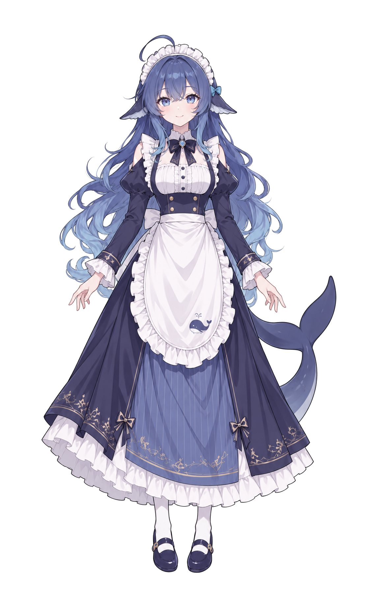

# DeepSeek 大肥鱼 / Whale-girl design resources

[项目首页](../../README.md) · [English](#english) · [Live2D 接入](../../docs/LIVE2D.md)

这里保存项目制作的鲸鱼娘女仆同人设计稿与基础资源。它们经过 AI 辅助绘制、人工方向选择和本地图像处理；目录名 `original-design` 用于区分项目产物与外部参考，**不表示角色概念、参考形象或所有权利均由本项目独创**。本项目与 DeepSeek 官方没有已声明的合作或背书关系。

## 包含的资源

| 文件 | 内容 | 状态 |
| --- | --- | --- |
| [whale-design.png](whale-design.png) | 937 × 1678 白底全身设计稿 | 项目选定的造型基准 |
| [whale-transparent.png](whale-transparent.png) | 1117 × 1858 透明整稿 | 原始可见像素抠图，边缘留白 |
| [whale-avatar.png](whale-avatar.png) | 512 × 512 头像 | 从设计稿裁切，适合作为本地头像素材 |
| [whale-layers.psd](whale-layers.psd) | 44 层基础拆分 PSD | 36 个可见部件、8 个补绘部件；身体遮挡补全仍不完整 |
| [assets.json](assets.json) | 文件大小和 SHA-256 | 发布副本校验清单，无私有制作路径 |

**没有 `.moc3`、`.model3.json` 或完成绑定的 Cubism 工程。** 静态整稿和拆层不是可直接运行的 Live2D 模型。还需要网格、变形器、参数绑定、物理、表情和连续动作验证。

公开副本移除了设计稿 PNG 的非像素 provenance 元数据容器；像素与原设计一致，AI 辅助制作事实保留在本说明中。其他 PNG 不含文本/EXIF 元数据，PSD 仅有工具版本资源和命名图层；不附源参考图、私有生成记录、制作日志或现用第三方 Live2D 的任何资产。

## 来源与权利说明

历史参考入口为 [fornarwhal/deepseek-whale-girl-icon](https://github.com/fornarwhal/deepseek-whale-girl-icon)。该仓库署名上善无形（OC「溟月」）、ZipZipPipe 和 QYQCAMIAO，并标示 [CC BY-NC-SA 4.0](https://creativecommons.org/licenses/by-nc-sa/4.0/)；它同时说明原图具体作者未确认。这里按来源披露，**不是替上游证明完整授权链**。

本目录中的文件是项目后续生成与拆层的设计产物，不是该仓库原图的原样拷贝。上游可能涉及的署名、非商业使用、相同方式共享及角色权利要求，不因 AI 重绘或本地处理消失。不要将本目录理解为已获商用许可、官方角色授权或无条件再分发授权。公开上传前应核实衍生作品的发布范围；在授权链没有厘清时，不能对第三方承诺已完成权利清理。

软件代码、设计稿和第三方 Live2D 模型是不同的授权对象。代码的[非商业使用及署名许可](../../../LICENSE)只覆盖项目作者有权许可的原创部分，不会替代这些角色素材的上游条款。现用不可二次转发的 Live2D 模型不在这个发布包中。

## English

This directory contains project-produced whale-girl maid fan artwork, created through AI-assisted drawing, human visual selection and local image processing. The name `original-design` distinguishes project outputs from reference files; it does **not** claim original ownership of the underlying character concept or all associated rights. No official DeepSeek affiliation or endorsement is asserted.

Included: a full-body concept image, transparent artwork, a 512-pixel avatar, a 44-layer PSD and a checksum manifest. The PSD contains 36 visible components and eight supplemental layers; body occlusions are incomplete. There is **no rigged Cubism project or Live2D runtime model**. Meshing, deformers, parameter rigging, physics and continuous-motion validation remain necessary.

Non-pixel provenance-container metadata was removed from the release copy of the concept PNG without changing pixels. AI-assisted production is explicitly disclosed here. Private generation logs, original reference images and the existing third-party Live2D assets are not included.

The historical reference repository is [fornarwhal/deepseek-whale-girl-icon](https://github.com/fornarwhal/deepseek-whale-girl-icon). It credits 上善无形, ZipZipPipe and QYQCAMIAO, states [CC BY-NC-SA 4.0](https://creativecommons.org/licenses/by-nc-sa/4.0/), and also acknowledges uncertainty about the exact original image author. This is a provenance record, **not proof of a complete chain of permission**.

These files are subsequent project-generated and separated artwork, not verbatim copies of that repository's original image. Redrawing does not remove underlying attribution, noncommercial, share-alike or character-rights obligations. Commercial use, official character licensing and unrestricted redistribution are not granted by this document. Verify the scope of derivative publication before public upload; do not represent unresolved rights as cleared.

The software’s [Noncommercial and Attribution License](../../../LICENSE) covers only original material the project authors have the right to license; it does not replace artwork or third-party model terms. The non-redistributable character used by the private installation is excluded.
